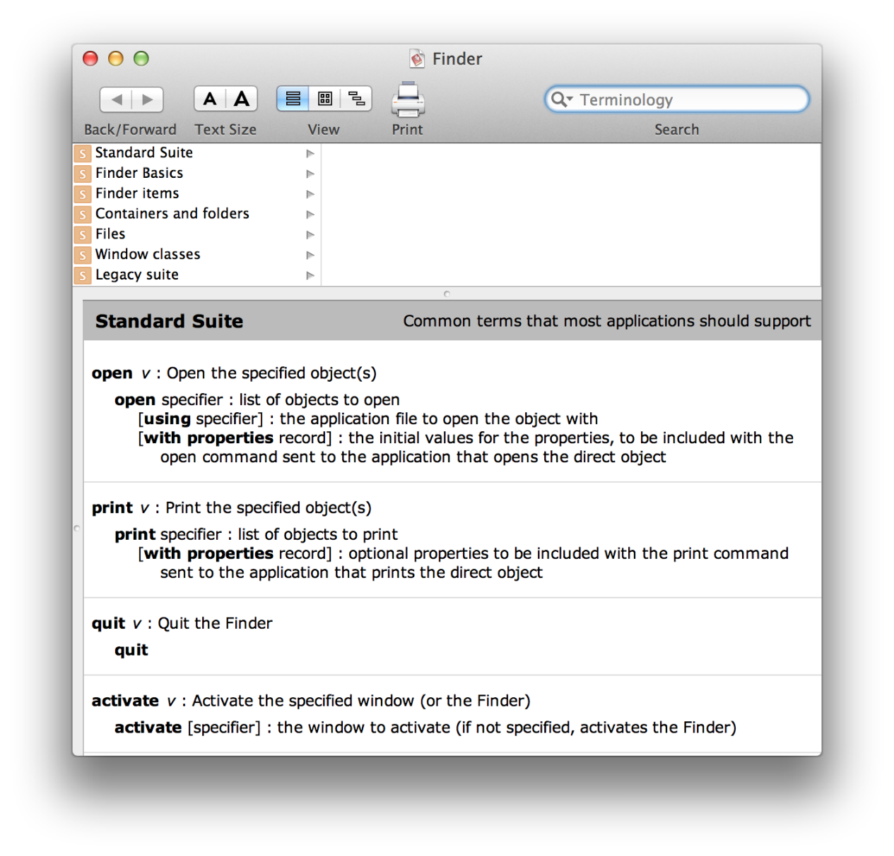

# Scripting with AppleScript

The following is a brief introduction to AppleScript scripts, tools for working with them, and information on using AppleScript scripts together with other scripting systems. For related documents, see the learning paths in *Getting Started with AppleScript*.

## Script Editor and AppleScript Scripts

An AppleScript script consists of one or more statements, written in a syntax described in [AppleScript Language Guide](http://developer.apple.com/documentation/AppleScript/Conceptual/AppleScriptLangGuide/index.html) (and in a number of third-party books). AppleScript defines some scripting terms, while scriptable applications and parts of the Mac OS specify additional terms for scriptable features they support. Scripting terminologies generally use common English words, resulting in scripts that are easier to read. For example, the following is a valid script statement:

|  |
| --- |
| ``` display dialog "Welcome to AppleScript." ``` |

Users can compile and execute scripts with the [Script Editor](#//apple_ref/doc/uid/TP40001568-1152365) application and can save them in various executable formats, including as stand-alone applications.

### A Simple AppleScript Script

Listing 1 shows an AppleScript script that simply returns the number of files in the `Applications` folder on the current system disk (denoted by `startup disk`, a term understood by the Finder). If the folder cannot be found, the script returns a count of zero. This script counts just files in the specified folder, not folders or the files they might contain.

**Listing 1**  A script that counts the files in the Applications folder

|  |
| --- |
| ``` tell application "Finder" ``` |
| ```     if folder "Applications" of startup disk exists then ``` |
| ```         return count files in folder "Applications" of startup disk ``` |
| ```     else ``` |
| ```         return 0 ``` |
| ```     end if ``` |
| ``` end tell ``` |

When a script is compiled and executed, some statements perform basic operations, such as assigning a variable or returning a value. A statement that targets a scriptable application results in an Apple event being sent to that application. The application can return information to the script in a reply Apple event.

The script in Listing 1 causes an Apple event to be sent to the Finder, which locates the Applications folder on the startup disk, counts the files in it, and returns that value. The `if...then...else` structure is one of several standard programming language features that AppleScript supports.

### Script Editor

The Script Editor application is located in `/Applications/AppleScript`. It provides the ability to edit, compile, and execute scripts, display application scripting terminologies, and save scripts in a variety of formats, such as compiled scripts, applications, bundled applications, and plain text.

Script Editor can display the result of executing an AppleScript script and can display a log of the Apple events that are sent during execution of a script. In the Script Editor Preferences, you can also choose to keep a history of recent results or event logs.

Script Editor has text formatting preferences for various types of script text, such as language keywords, comments, and so on. You can also turn on or off the Script Assistant, a code completion tool that can suggest and fill in scripting terms as you type. In addition, Script Editor provides a contextual menu to insert many types of boilerplate script statements, such as conditionals, comments, and error handlers.

#### Displaying Scripting Dictionaries

You can choose File > Open Dictionary in Script Editor to examine the scripting dictionary of a scriptable application or scripting addition on your computer. Or you can drag an application icon to the Script Editor icon to display its dictionary (if it has one). You can also open scripting dictionaries in Xcode.

To display a list that includes just the scriptable applications and scripting additions provided by the Mac OS, choose Window > Library. Double-click an item in the list to display its dictionary. Figure 1 shows the dictionary for the Finder application in OS X version 10.5. The dictionary is labeled as “Finder.sdef”. The sdef format, along with other terminology formats, is described in [Specifying Scripting Terminology](scriptable_apps.md#//apple_ref/doc/uid/TP40001569-1156165).

**Figure 1**  The Finder dictionary in Script Editor (in OS X v10.5)



#### Debugging and Third Party Products

Script Editor supports only simple debugging strategies, such as logging event output and inserting `speak` or `display dialog` statements within scripts. However, there are a number of third-party products for working with AppleScript, some of them quite powerful. For example, there are script editors and tools for monitoring and debugging scripts, Apple events, and scriptable applications. Some of these third-party products are listed at the [AppleScript Resources](http://www.macosxautomation.com/applescript/resources.html) web page.

For information on debugging scriptable applications and Apple events, see the documents *[Cocoa Scripting Guide](../../../../Cocoa/Conceptual/ScriptableCocoaApplications/SApps_intro/SAppsIntro.html#//apple_ref/doc/uid/TP40002164)* and *[Apple Events Programming Guide](../../AppleEvents/intro_aepg/intro_aepg.html#//apple_ref/doc/uid/TP40001449)*.

### Interacting with the User in Scripts

AppleScript provides little direct support for interacting with the user in scripts. However, the Standard Additions scripting addition provides terminology for obtaining various choices from the user. For example, it includes commands for letting the user choose an application, a color, a file, a filename, and so on. It also provides the `display dialog` command, which allows you to display a dialog with various options for text labels, buttons, and text input. Scripting Additions are described in [Extending AppleScript with Coercions, Scripting Additions, and Faceless Background Applications](osa.md#//apple_ref/doc/uid/TP40001571-1164068).

## What You Can Control with Scripts

Many applications from Apple are scriptable and you can also script some parts of the Mac OS. For example, the Finder, iTunes, QuickTime Player, and Mail are highly scriptable. For a complete list, see the [Scriptable Applications](http://www.macosxautomation.com/applescript/resources.html) web page at the [AppleScript](http://www.macosxautomation.com/applescript/index.html) website. For more information on scriptability provided by Apple, see [AppleScript Utilities and Applications](as_related_apps.md#//apple_ref/doc/uid/TP40001570-BABEBGCF).

> **Note:** You can also control many Apple technologies and applications with [Automator](automator.md#//apple_ref/doc/uid/TP40006469-SW1), which is available starting in OS X version 10.4.

Many third-party applications are scriptable—their advertising and packaging usually mention if they are scriptable. The documentation for a scriptable application typically lists the AppleScript terminology that the application understands. You can also determine if an application is scriptable by attempting to examine its dictionary with the Script Editor application, as described in [Displaying Scripting Dictionaries](#//apple_ref/doc/uid/TP40001568-1153006).

> **Note:** For a list of scriptable applications from all parties, see “Scriptable Applications” at the [MacScripter](http://macscripter.net/) website.

## Using AppleScript with Web Services

XML-RPC and SOAP are remote procedure call protocols that support exchanging commands and information over the Internet. Starting with OS X version 10.1, AppleScript and the Apple Event Manager provide XML-RPC and SOAP support such that:

* Scripters can make XML-RPC calls and SOAP requests from scripts.
* Developers can make XML-RPC calls and SOAP requests from applications or other code by sending Apple events.

For documentation on using AppleScript with web services, see *[XML-RPC and SOAP Programming Guide](../../soapXMLRPC/chapter1/soapXMLRPC_intro.html#//apple_ref/doc/uid/TP30001126)* (some examples may be out of date). For additional sources and examples, see [Web Services](http://www.macosxautomation.com/applescript/resources.html). For information on developing web content and applications for the web in OS X, see *[Getting Started with Internet and Web](../../../../../referencelibrary/GettingStarted/GS_WebInternet/_index.html#//apple_ref/doc/uid/TP30001123)*.

## Using AppleScript with Other Scripting Systems

OS X supports a UNIX-like shell environment that is familiar to many developers. That support includes the Terminal application, located in `/Applications/Utilities`, which you can use to open shell windows and execute shell scripts. AppleScript provides two convenient mechanisms to interact with a shell environment: you can execute shell commands from within AppleScript scripts and you can execute AppleScript scripts as shell commands.

### Executing Shell Commands From AppleScript Scripts

AppleScript provides the `do shell script` command to support executing a shell command as part of an AppleScript script. For example, the following script statement uses a `do shell script` command to change the directory to the current user’s home directory and obtain a list of the files found there. The list information is stored in the AppleScript variable `fileInfo`:

|  |
| --- |
| ``` set fileInfo to do shell script "cd ~; ls" ``` |

The `do shell script` command is primarily of use to scripters. Although applications can execute AppleScript scripts that use the `do shell script` command, they have more efficient options for executing shell commands, as described in [Support for Carbon Applications](scriptable_apps.md#//apple_ref/doc/uid/TP40001569-1150941) and [Support for Cocoa Applications](scriptable_apps.md#//apple_ref/doc/uid/TP40001569-1151567). For more information on the `do shell script` command, see Technical Note TN2065, [do shell script in AppleScript](http://developer.apple.com/technotes/tn2002/tn2065.html).

### Executing AppleScript Scripts as Shell Commands

To execute AppleScript scripts as shell commands in a Terminal window or shell script file, you can use the `osacompile` command and the `osascript` command (located in `/usr/bin`). The former compiles an AppleScript script, while the latter executes a plain text or a compiled AppleScript script. Man pages provide documentation for these commands. For example, type `man osascript` in a Terminal window to get information on the `osascript` command.

Starting in OS X version 10.5, there is a command-line tool to display compiled scripts as text, `osadecompile`. Again, see the man page for details.

Also starting in Mac OX X v10.5, AppleScript allows use of the # symbol as a comment-to-end-of-line token (the traditional double hyphen (--) is also still supported). This means that you can make a plain AppleScript script into a Unix executable by beginning it with the following line and giving it execute permission.

|  |
| --- |
| ``` #!/usr/bin/osascript ``` |

### Scripting the Terminal Application

The Terminal application is itself scriptable. For example, you can use the `do script` command to execute text as a shell script or command. To see the operations Terminal supports, you can examine its scripting dictionary with Script Editor.

### Using Other Scripting Languages

For those who have experience with various scripting languages and environments, the previous sections have probably already provided an urge to start experimenting. And you do have a lot of options for combining features from the scripting tools, languages, and environments that are most appropriate for specific kinds of tasks. For example, the following one-line shell script statement combines Perl, AppleScript, and various tools to find duplicate entries in the Address Book application.

|  |
| --- |
| ``` osascript -e 'tell app "Address Book" to get the name of every person' | perl -pe 's/, /\n/g' | sort | uniq -d ``` |

This statement uses `osascript` to execute an inline AppleScript script (`'tell app "Address Book" to get the name of every person'`) that returns the names of every address entry from the Address Book application. It pipes the output of this script through the `perl` tool, and with a series of other commands and pipes, obtains and formats a (possibly empty) list of duplicate names.

For additional information about working with AppleScript from languages such as Ruby and Python, see [Scripting Bridge](scripting_bridge.md#//apple_ref/doc/uid/TP40006467-SW1).

  

---

Copyright © 2002, 2007 Apple Inc. All Rights Reserved. [Terms of Use](http://www.apple.com/legal/internet-services/terms/site.html) | [Privacy Policy](http://www.apple.com/privacy/) | Updated: 2007-10-31
