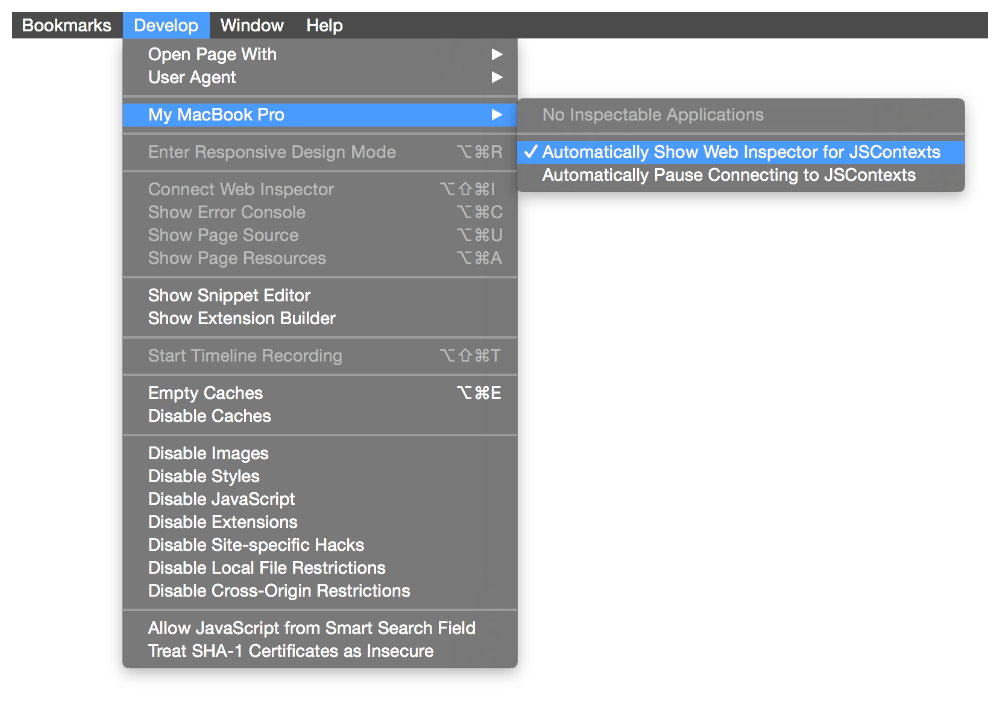

# OS X 10.11 Release Notes

This article describes changes to JavaScript for Automation in OS X 10.11.

## Debugging

JavaScript for Automation now allows you to debug scripts with Safari's Web Inspector. This feature can be used by scripts run in Script Editor and by the Run JavaScript action in Automator.

To debug scripts, you must enable the Web Inspector in Safari and add debugger statements to your scripts.

### Set Up Safari

To enable debugging with the Web Inspector, follow the steps described in the [Enabling Web Inspector](../../../../documentation/AppleApplications/Conceptual/Safari_Developer_Guide/GettingStarted/GettingStarted.html#//apple_ref/doc/uid/TP40007874-CH2-SW2) section of *[Safari Web Inspector Guide](../../../../documentation/AppleApplications/Conceptual/Safari_Developer_Guide/Introduction/Introduction.html#//apple_ref/doc/uid/TP40007874)*.

Once you've enabled the Web Inspector, you will find a submenu with your computer's name in Safari's Develop menu. In that submenu, make sure the menu item Automatically Show Web Inspector for JSContexts is selected.

**Figure 1**  Enabling the Safari Web Inspector for JSContexts


> **Note:** Keep Safari opened while testing your scripts, as debugging is only possible while Safari is running.

### Run Scripts

In Script Editor or the Run JavaScript action in Automator, create a script with a debugger statement in it. For example:

```
var x = false
debugger
if (x) {
    console.log("Why isn't this being called?")
}
```

Run the script. If Safari is running, an inspector window appears and pauses on the debugger line.

You must recompile a script before you can debug it again.

> **Note:** For more information on using the Web Inspector, refer to the [Debugger](../../../../documentation/AppleApplications/Conceptual/Safari_Developer_Guide/Debugger/Debugger.html#//apple_ref/doc/uid/TP40007874-CH5) chapter of *[Safari Web Inspector Guide](../../../../documentation/AppleApplications/Conceptual/Safari_Developer_Guide/Introduction/Introduction.html#//apple_ref/doc/uid/TP40007874)*.

## Strict Flags

JavaScript for Automation has flags on `Application` objects that affect how strictly properties and commands are looked up, and whether parameter types are checked before sending commands. These are discussed in more detail in the OS X 10.10 JavaScript for Automation release notes (see [Strict Flags](OSX10-10.html#//apple_ref/doc/uid/TP40014508-CH109-SW34)).

For OS X 10.11, all strict flags are now set to `false` by default. This means that any property or command listed in a scripting dictionary is valid to access or call on any object in the application. You can send any type of parameter to a command, regardless of what the scripting dictionary says.

## Exposed Application Properties

JavaScript for Automation now exposes an `id` property and a `running` property on all `Application` objects. These properties return an application's bundle identifier and whether the application is running, respectively. Like getting an application's `name`, `version`, or `frontmost` property, these are called as functions.

Here’s an example that demonstrates how to retrieve Mail's bundle identifier and running status.

```
Mail = Application('Mail')
Mail.id()
Mail.running()
```

## Script Libraries

JavaScript for Automation includes some enhancements to the way script libraries work.

### New Search Mechanisms

JavaScript for Automation now has two additional search mechanisms you can use when searching for script libraries:

* You can place script libraries in the `Contents/Library/Script Libraries` directory of any installed application bundle. This allows distribution of libraries associated with an application, or creating applications for the sole purpose of distributing libraries.
* Use the environment variable `OSA_LIBRARY_PATH` to add more locations to search for script libraries. This feature allows you to use a library without installing it in one of the standard locations. The variable’s value is a colon-separated list of absolute POSIX paths, such as `OSA_LIBRARY_PATH='/opt/local/Script Libraries:/usr/local/Script Libraries'`.

For additional details, see [Creating a Library](../../../../documentation/AppleScript/Conceptual/AppleScriptLangGuide/conceptual/ASLR_script_objects.html#//apple_ref/doc/uid/TP40000983-CH207-SW13) in *[AppleScript Language Guide](../../../../documentation/AppleScript/Conceptual/AppleScriptLangGuide/introduction/ASLR_intro.html#//apple_ref/doc/uid/TP40000983)*.

### Catchable Custom Errors

Custom errors thrown from script libraries are now catchable by client scripts. Prior to OS X 10.11, all errors thrown by script libraries became generic `(-10000)` errors when caught by the client script.

  

---

Copyright © 2015 Apple Inc. All Rights Reserved. [Terms of Use](http://www.apple.com/legal/internet-services/terms/site.html) | [Privacy Policy](http://www.apple.com/privacy/) | Updated: 2015-09-16
