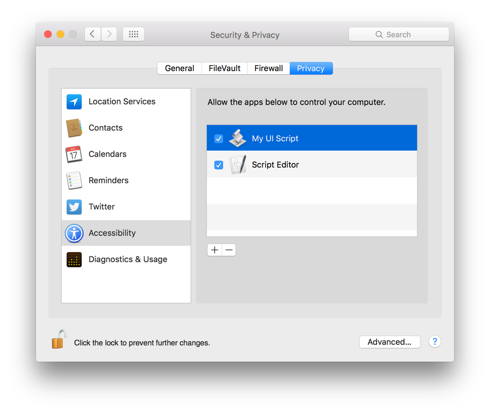
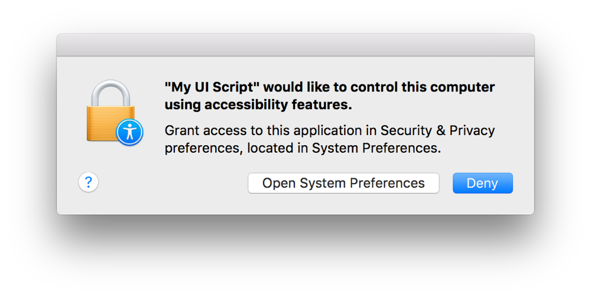
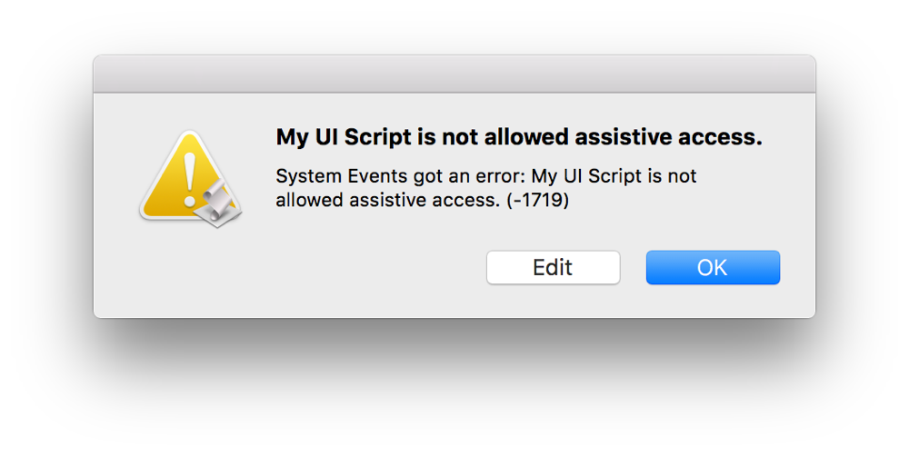
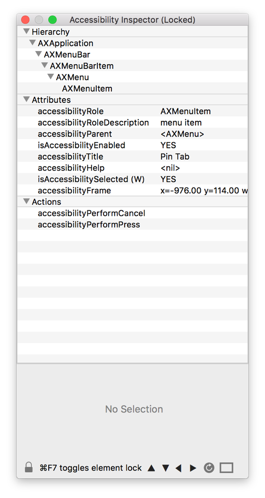

## Automating the User Interface

Unfortunately, not every Mac app has scripting support, and those that do may not always have scripting support for every task you want to automate. You can often work around such limitations, however, by writing a user interface script, commonly called a UI or GUI script. A user interface script simulates user interaction, such as mouse clicks and keystrokes, allowing the script to select menu items, push buttons, enter text into text fields, and more.

### Enabling User Interface Scripting

User interface scripting relies upon the OS X accessibility frameworks that provide alternative methods of querying and controlling the interfaces of apps and the system. By default, accessibility control of apps is disabled. For security and privacy reasons, the user must manually enable it on an app-by-app (including script apps) basis.

**To enable accessibility control for an app**

1. Launch System Preferences and click Security & Privacy.
2. Click the Privacy tab.
3. Click Accessibility.
4. Click the Add button (+).
5. Choose an app and click Open.
6. Select the checkbox to the left of the app.

   

When running an app that requires accessibility control for the first time, the system prompts you to enable it. See Figure 37-1.

**Figure 37-1**An accessibility control prompt

Attempting to run an app that has not been given permission to use accessibility features results in an error. See Figure 37-2.

**Figure 37-2**An accessibility control error

> **Note**
>
>
> To run a user interface script in Script Editor, you must enable accessibility for Script Editor.
>
> Admin credentials are required to perform enable user interface scripting.

### Targeting an App

User interface scripting terminology is found in the Processes Suite of the System Events scripting dictionary. This suite includes terminology for interacting with most types of user interface elements, including windows, buttons, checkboxes, menus, radio buttons, text fields, and more. In System Events, the `process` class represents a running app. Listing 37-1 shows how to target an app using this class.

**APPLESCRIPT**

[Open in Script Editor](applescript://com.apple.scripteditor?action=new&script=tell%20application%20%22System%20Events%22%0A%20%20%20%20tell%20process%20%22Safari%22%0A%20%20%20%20%20%20%20%20--%20Perform%20user%20interface%20scripting%20tasks%0A%20%20%20%20end%20tell%0Aend%20tell)

**Listing 37-1**AppleScript: Targeting an app for user interface scripting

1. `tell application "System Events"`
2. ` tell process "Safari"`
3. ` -- Perform user interface scripting tasks`
4. ` end tell`
5. `end tell`

To control the user interface of an app, you must first inspect the app and determine its element hierarchy. This can be done by querying the app. For example, Listing 37-2 asks Safari for a list of menus in the menu bar.

**APPLESCRIPT**

[Open in Script Editor](applescript://com.apple.scripteditor?action=new&script=tell%20application%20%22System%20Events%22%0A%20%20%20%20tell%20process%20%22Safari%22%0A%20%20%20%20%20%20%20%20name%20of%20every%20menu%20of%20menu%20bar%201%0A%20%20%20%20end%20tell%0Aend%20tell%0A--%3E%20Result%3A%20%7B%22Apple%22%2C%20%22Safari%22%2C%20%22File%22%2C%20%22Edit%22%2C%20%22View%22%2C%20%22History%22%2C%20%22Bookmarks%22%2C%20%22Develop%22%2C%20%22Window%22%2C%20%22Help%22%7D)

**Listing 37-2**AppleScript: Querying an app for user interface element information

1. `tell application "System Events"`
2. ` tell process "Safari"`
3. ` name of every menu of menu bar 1`
4. ` end tell`
5. `end tell`
6. `--> Result: {"Apple", "Safari", "File", "Edit", "View", "History", "Bookmarks", "Develop", "Window", "Help"}`

Accessibility Inspector (Figure 37-3) makes it even easier to identify user interface element information. This app is included with Xcode. To use it, open Xcode and select Xcode > Open Developer Tool > Accessibility Inspector.

**Figure 37-3**Accessibility Inspector

Once you know how an element fits into an interface, you target it within that hierarchy. For example, `button X of window Y of process Z`.

### Clicking a Button

Use the `click` command to click a button. Listing 37-3 clicks a button in the Safari toolbar to toggle the sidebar between open and closed.

**APPLESCRIPT**

[Open in Script Editor](applescript://com.apple.scripteditor?action=new&script=tell%20application%20%22System%20Events%22%0A%20%20%20%20tell%20process%20%22Safari%22%0A%20%20%20%20%20%20%20%20tell%20toolbar%20of%20window%201%0A%20%20%20%20%20%20%20%20%20%20%20%20click%20%28first%20button%20where%20its%20accessibility%20description%20%3D%20%22Sidebar%22%29%0A%20%20%20%20%20%20%20%20end%20tell%0A%20%20%20%20end%20tell%0Aend%20tell%0A--%3E%20Result%3A%20%7Bbutton%201%20of%20toolbar%201%20of%20window%20%22AppleScript%3A%20Graphic%20User%20Interface%20%28GUI%29%20Scripting%22%20of%20application%20process%20%22Safari%22%20of%20application%20%22System%20Events%22%7D)

**Listing 37-3**AppleScript: Clicking a button

1. `tell application "System Events"`
2. ` tell process "Safari"`
3. ` tell toolbar of window 1`
4. ` click (first button where its accessibility description = "Sidebar")`
5. ` end tell`
6. ` end tell`
7. `end tell`
8. `--> Result: {button 1 of toolbar 1 of window "AppleScript: Graphic User Interface (GUI) Scripting" of application process "Safari" of application "System Events"}`

### Choosing a Menu Item

Menu items can have a fairly deep hierarchy within the interface of an app. A menu item generally resides within a menu, which resides within a menu bar. In scripting, they must be addressed as such. Listing 37-4 selects the Pin Tab menu item in the Window menu of Safari.

**APPLESCRIPT**

[Open in Script Editor](applescript://com.apple.scripteditor?action=new&script=tell%20application%20%22System%20Events%22%0A%20%20%20%20tell%20process%20%22Safari%22%0A%20%20%20%20%20%20%20%20set%20frontmost%20to%20true%0A%20%20%20%20%20%20%20%20click%20menu%20item%20%22Pin%20Tab%22%20of%20menu%20%22Window%22%20of%20menu%20bar%201%0A%20%20%20%20end%20tell%0Aend%20tell%0A--%3E%20Result%3A%20menu%20item%20%22Pin%20Tab%22%20of%20menu%20%22Window%22%20of%20menu%20bar%20item%20%22Window%22%20of%20menu%20bar%201%20of%20application%20process%20%22Safari%22%20of%20application%20%22System%20Events%22)

**Listing 37-4**AppleScript: Choosing a menu item

1. `tell application "System Events"`
2. ` tell process "Safari"`
3. ` set frontmost to true`
4. ` click menu item "Pin Tab" of menu "Window" of menu bar 1`
5. ` end tell`
6. `end tell`
7. `--> Result: menu item "Pin Tab" of menu "Window" of menu bar item "Window" of menu bar 1 of application process "Safari" of application "System Events"`

> **Note**
>
>
> Scripting the user interface of an app can be tedious and repetitious. To streamline the process, consider creating handlers to perform common functions. For example, Listing 37-5 shows a handler that can be used to choose any menu item of any menu in any running app.
>
> **APPLESCRIPT**
>
> [Open in Script Editor](applescript://com.apple.scripteditor?action=new&script=on%20chooseMenuItem%28theAppName%2C%20theMenuName%2C%20theMenuItemName%29%0A%20%20%20%20try%0A%20%20%20%20%20%20%20%20--%20Bring%20the%20target%20app%20to%20the%20front%0A%20%20%20%20%20%20%20%20tell%20application%20theAppName%0A%20%20%20%20%20%20%20%20%20%20%20%20activate%0A%20%20%20%20%20%20%20%20end%20tell%0A%0A%20%20%20%20%20%20%20%20--%20Target%20the%20app%0A%20%20%20%20%20%20%20%20tell%20application%20%22System%20Events%22%0A%20%20%20%20%20%20%20%20%20%20%20%20tell%20process%20theAppName%0A%0A%20%20%20%20%20%20%20%20%20%20%20%20%20%20%20%20--%20Target%20the%20menu%20bar%0A%20%20%20%20%20%20%20%20%20%20%20%20%20%20%20%20tell%20menu%20bar%201%0A%0A%20%20%20%20%20%20%20%20%20%20%20%20%20%20%20%20%20%20%20%20--%20Target%20the%20menu%20by%20name%0A%20%20%20%20%20%20%20%20%20%20%20%20%20%20%20%20%20%20%20%20tell%20menu%20bar%20item%20theMenuName%0A%20%20%20%20%20%20%20%20%20%20%20%20%20%20%20%20%20%20%20%20%20%20%20%20tell%20menu%20theMenuName%0A%0A%20%20%20%20%20%20%20%20%20%20%20%20%20%20%20%20%20%20%20%20%20%20%20%20%20%20%20%20--%20Click%20the%20menu%20item%0A%20%20%20%20%20%20%20%20%20%20%20%20%20%20%20%20%20%20%20%20%20%20%20%20%20%20%20%20click%20menu%20item%20theMenuItemName%0A%20%20%20%20%20%20%20%20%20%20%20%20%20%20%20%20%20%20%20%20%20%20%20%20end%20tell%0A%20%20%20%20%20%20%20%20%20%20%20%20%20%20%20%20%20%20%20%20end%20tell%0A%20%20%20%20%20%20%20%20%20%20%20%20%20%20%20%20end%20tell%0A%20%20%20%20%20%20%20%20%20%20%20%20end%20tell%0A%20%20%20%20%20%20%20%20end%20tell%0A%20%20%20%20%20%20%20%20return%20true%0A%20%20%20%20on%20error%0A%20%20%20%20%20%20%20%20return%20false%0A%20%20%20%20end%20try%0Aend%20chooseMenuItem)
>
> **Listing 37-5**AppleScript: A handler that chooses a menu item
>
> 1. `on chooseMenuItem(theAppName, theMenuName, theMenuItemName)`
> 2. ` try`
> 3. ` -- Bring the target app to the front`
> 4. ` tell application theAppName`
> 5. ` activate`
> 6. ` end tell`
> 7. ` `
> 8. ` -- Target the app`
> 9. ` tell application "System Events"`
> 10. ` tell process theAppName`
> 11. ` `
> 12. ` -- Target the menu bar`
> 13. ` tell menu bar 1`
> 14. ` `
> 15. ` -- Target the menu by name`
> 16. ` tell menu bar item theMenuName`
> 17. ` tell menu theMenuName`
> 18. ` `
> 19. ` -- Click the menu item`
> 20. ` click menu item theMenuItemName`
> 21. ` end tell`
> 22. ` end tell`
> 23. ` end tell`
> 24. ` end tell`
> 25. ` end tell`
> 26. ` return true`
> 27. ` on error`
> 28. ` return false`
> 29. ` end try`
> 30. `end chooseMenuItem`
>
> Listing 37-6 calls the handler in Listing 37-5 to select the Pin Tab menu item in the Window menu of Safari.
>
> **APPLESCRIPT**
>
> [Open in Script Editor](applescript://com.apple.scripteditor?action=new&script=chooseMenuItem%28%22Safari%22%2C%20%22Window%22%2C%20%22Pin%20Tab%22%29)
>
> **Listing 37-6**AppleScript: Calling a handler to choose a menu item
>
> 1. `chooseMenuItem("Safari", "Window", "Pin Tab")`

### Choosing a Submenu Item

Some menus contain other menus. In these cases, it may be necessary to select a menu item in a submenu of a menu. Listing 37-7 demonstrates how this would be done by selecting a submenu item in Safari.

**APPLESCRIPT**

[Open in Script Editor](applescript://com.apple.scripteditor?action=new&script=tell%20application%20%22System%20Events%22%0A%20%20%20%20tell%20process%20%22Safari%22%0A%20%20%20%20%20%20%20%20set%20frontmost%20to%20true%0A%20%20%20%20%20%20%20%20click%20menu%20item%20%22Email%20This%20Page%22%20of%20menu%20of%20menu%20item%20%22Share%22%20of%20menu%20%22File%22%20of%20menu%20bar%201%0A%20%20%20%20end%20tell%0Aend%20tell%0A--%3E%20Result%3A%20%7Bmenu%20item%20%22Email%20This%20Page%22%20of%20menu%20%22Share%22%20of%20menu%20item%20%22Share%22%20of%20menu%20%22File%22%20of%20menu%20bar%20item%20%22File%22%20of%20menu%20bar%201%20of%20application%20process%20%22Safari%22%20of%20application%20%22System%20Events%22%7D)

**Listing 37-7**AppleScript: Selecting a submenu item

1. `tell application "System Events"`
2. ` tell process "Safari"`
3. ` set frontmost to true`
4. ` click menu item "Email This Page" of menu of menu item "Share" of menu "File" of menu bar 1`
5. ` end tell`
6. `end tell`
7. `--> Result: {menu item "Email This Page" of menu "Share" of menu item "Share" of menu "File" of menu bar item "File" of menu bar 1 of application process "Safari" of application "System Events"}`
