

## Configuring Scripting Preferences

Script Editor preferences allows you to configure a variety of aspects of scripting behavior.

### General Preferences

In the General pane of Script Editor preferences (Figure 9-1), you can configure settings such as the following.

**Figure 9-1**General pane of Script Editor preferences
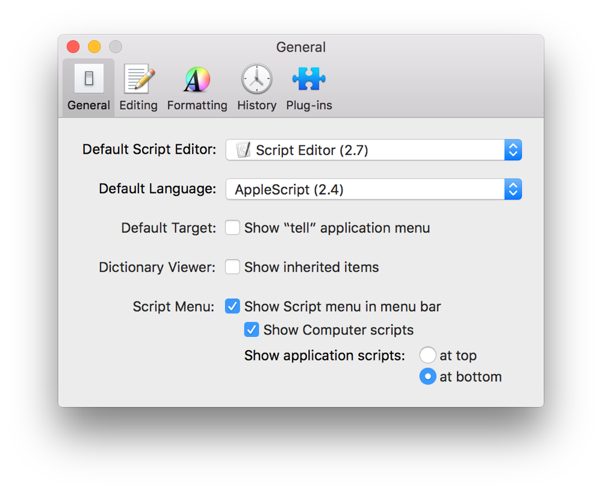

**Default Language**—The default scripting language when you create new Script Editor documents.

**Show “tell” application menu**—This setting can be enabled to add a tell application menu to the navigation bar. Selecting an app in this menu allows you to direct script execution to the chosen app. In Figure 9-2, the tell application menu is set to the Finder. As a result, the script itself doesn’t need to include a `tell application "Finder"` statement. It automatically understands the Finder’s terminology and sends events to the Finder.

**Figure 9-2**The tell application menu in a Script Editor document
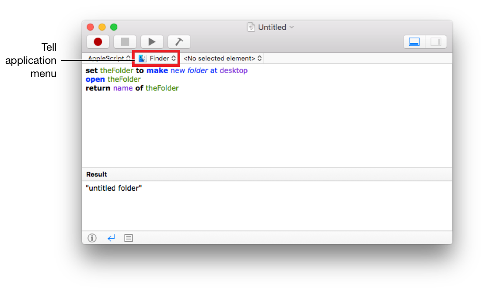

In addition, the current application object—which refers to the application currently executing the script—reflects the selected application, rather than Script Editor. See Listing 9-1 and Listing 9-2.

**APPLESCRIPT**

[Open in Script Editor](applescript://com.apple.scripteditor?action=new&script=name%20of%20current%20application)

**Listing 9-1**AppleScript: Targeting the current application object after setting the tell application menu in Script Editor to Finder

1. `name of current application`
2. `--&gt; Result: "Finder"`

**JAVASCRIPT**

[Open in Script Editor](applescript://com.apple.scripteditor?action=new&script=Application.currentApplication%28%29.name%28%29)

**Listing 9-2**JavaScript: Targeting the current application object after setting the tell application menu in Script Editor to Finder

1. `Application.currentApplication().name()`
2. `// Result: "Finder"`

**Show inherited items**—This setting can be enabled to display inherited object properties in the dictionary viewer. For example, in the Finder, a `file` object inherits the attributes of an `item` object. Without this setting enabled, the dictionary entry for `file` simply provide a a pointer to the `item` entry to view the `item` attributes. See Figure 9-3. With this option enabled, the `file` entry in the Finder’s scripting dictionary includes the attributes of an `item`. See Figure 9-4.

**Figure 9-3**Dictionary entry without inherited items
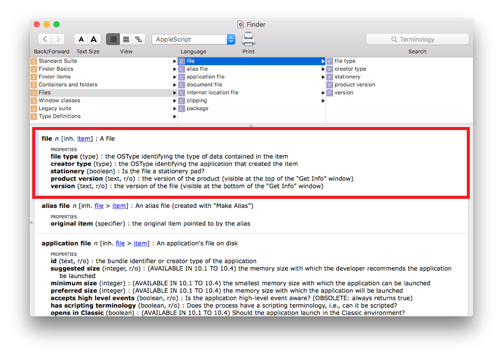

**Figure 9-4**Dictionary entry with inherited items
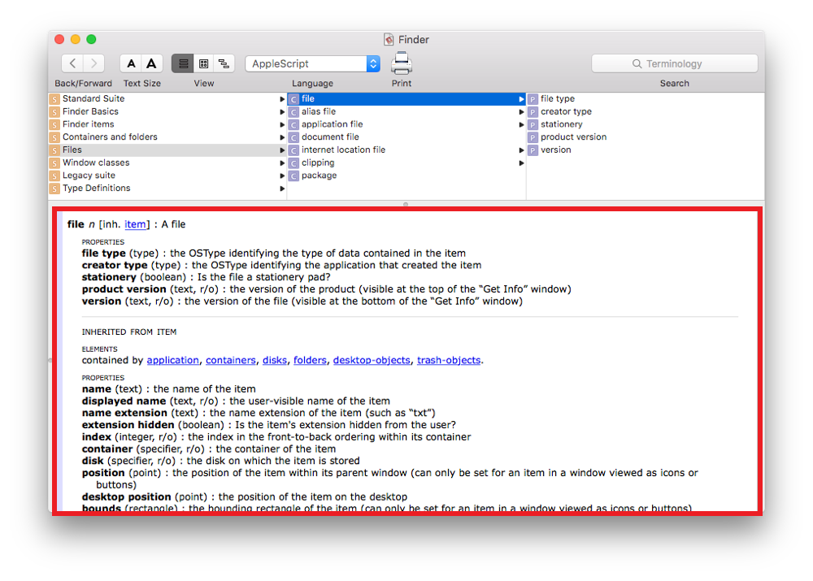

**Script Menu**—These settings allow you to enable and configure a systemwide script menu (Figure 9-5). This menu can be used to organize your scripts and provide access to them in any app.

**Figure 9-5**The systemwide script menu
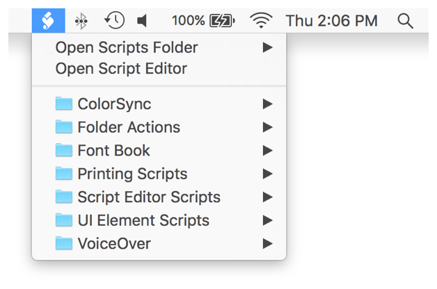

### Editing Preferences

In the Editing pane of Script Editor preferences, shown in Figure 9-6, you can configure settings such as the following.

**Figure 9-6**Editing pane of Script Editor preferences
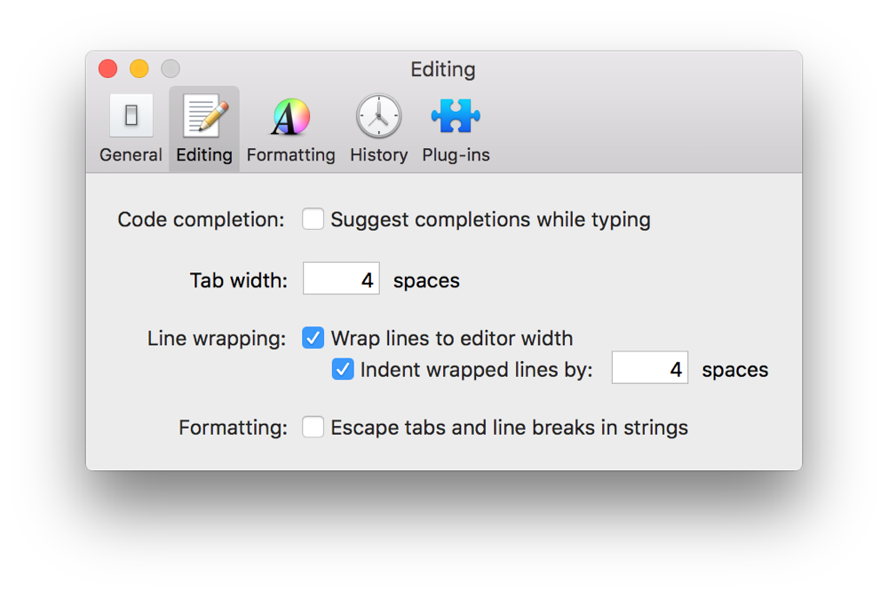

**Code completion**—When this option is enabled, Script Editor suggest code completions as you type a script (Figure 9-7).

**Figure 9-7**Code completion in Script Editor
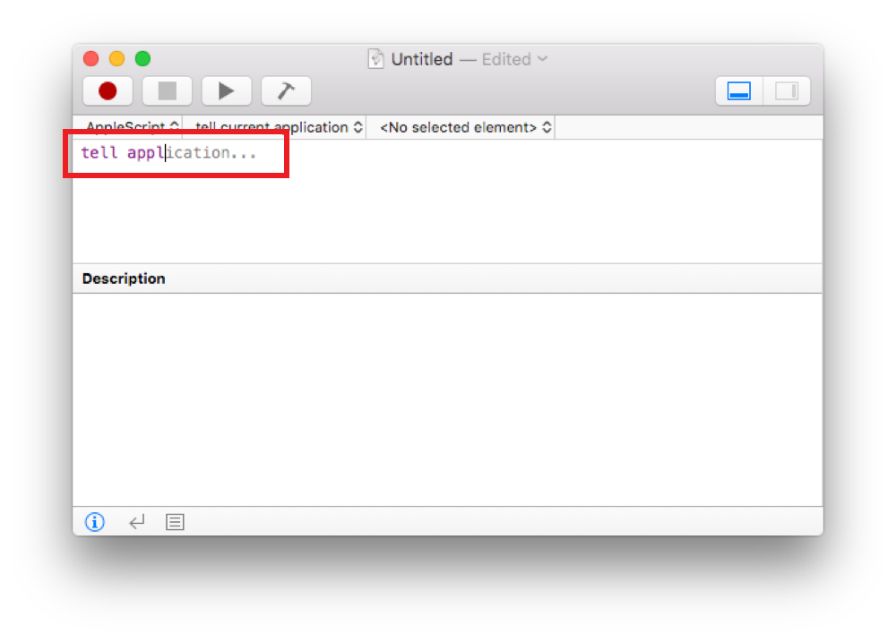

To accept and insert a code completion suggestion, press the F5 key or the Esc (Escape) key. If multiple code completion choices are available, a code completion dialog appears, allowing you to select a suggestion (see Figure 9-8).

**Figure 9-8**The code completion dialog in Script Editor
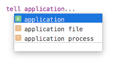

**Tab width and line wrapping**—Adjust how indentation and line wrapping occurs in the editor pane of Script Editor documents.

**Escape tabs and line breaks in strings**—This setting only affects AppleScripts. When this option is disabled, tabs and line breaks appear normally in a text string, as shown in Figure 9-9.

**Figure 9-9**A string containing normal tabs and line breaks
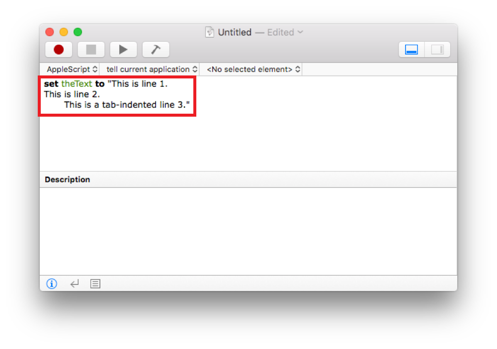

When this option is enabled, tabs and line breaks are replaced with escaped character equivalents—`/t` for a tab, and `/r` for a line break. See Figure 9-10.

**Figure 9-10**A string containing escaped tabs and line breaks
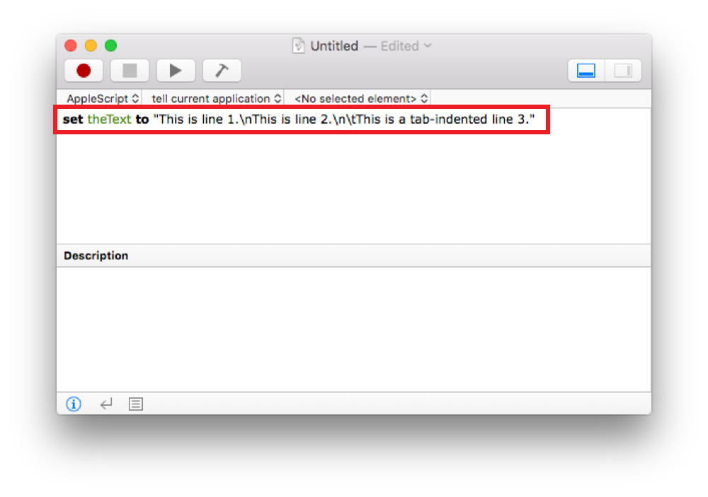

### Formatting Preferences

In the Formatting pane of Script Editor window (Figure 9-11), you can configure the style—font, point size, and color—of various script attributes, including new text, language keywords, comments, and variables. Formatting options are language-specific. Select a language from the Language popup menu to view that language’s formatting settings.

**Figure 9-11**Formatting pane of Script Editor preferences
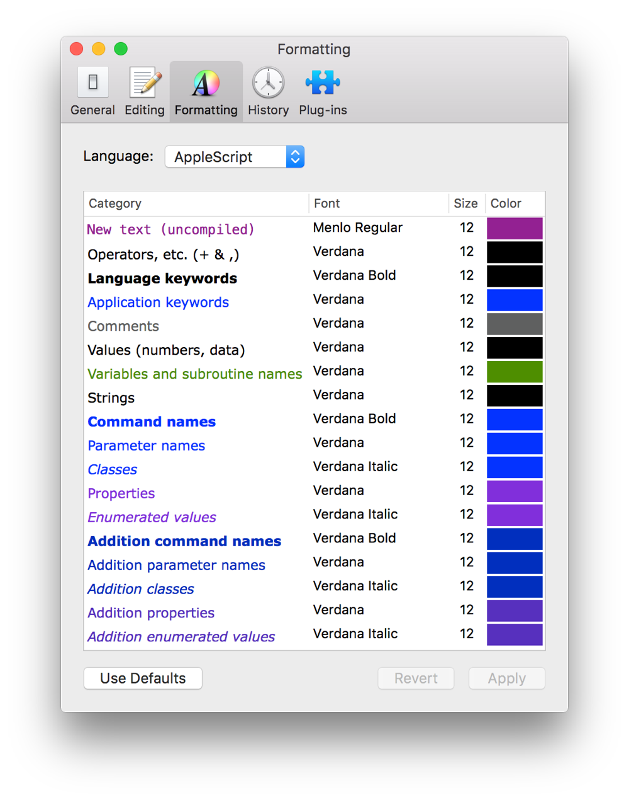

### History Preferences

In the History pane of Script Editor preferences (Figure 9-12), you can enable or disable the log history, adjust the quantity of log history entries, and enable logging only when the log is visible.

**Figure 9-12**History pane of Script Editor preferences
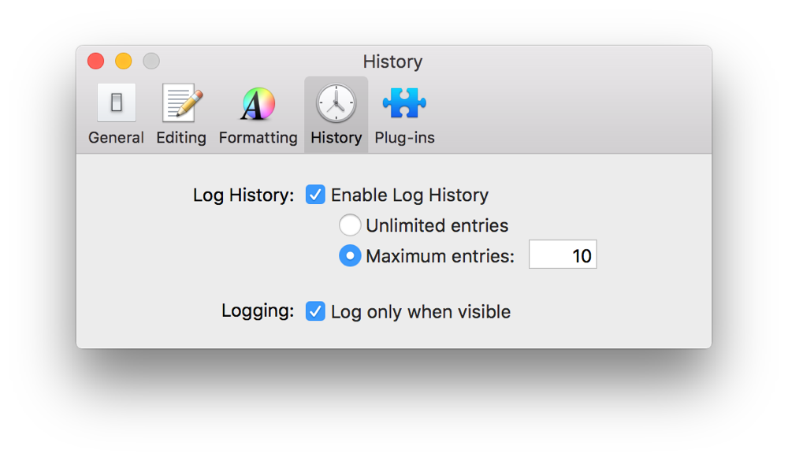

### Plug-ins Preferences

The Plug-ins pane of Script Editor preferences (Figure 9-13) lists any installed Script Editor plug-ins.

**Figure 9-13**Plug-ins pane of Script Editor preferences
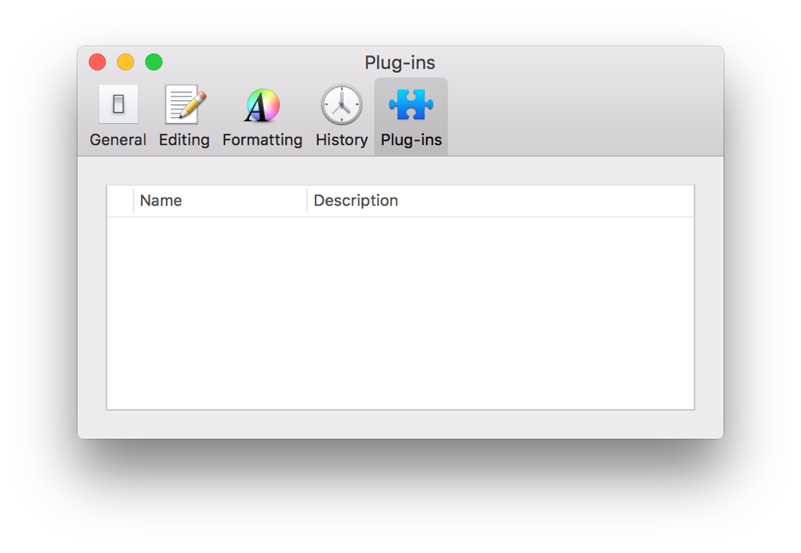
