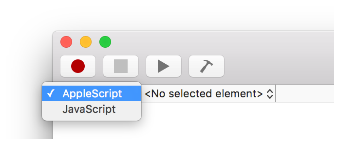

## Creating a Script

Generally, most scripts are written in Script Editor documents. Scripts can also be written in Xcode, but this is typically for scripts that require advanced user interfaces.

**To write a script in Script Editor**

1. Launch Script Editor in `/Applications/Utilities/`.
2. Press Command-N or select File &gt; New.
3. If the script isn’t configured for the correct language, choose the language in the navigation bar.

   

   

   

   Tip

   If you always use the same language, set it as the default language in the General pane of Script Editor preferences. See [General Preferences](ConfigureScriptingPreferences.html#//apple_ref/doc/uid/TP40016239-CH70-SW10).
4. Write your script code in the editing area. Newly written code is uncompiled and formatted as new text.

   

   
5. Click the Compile button () to compile the script and check for syntax errors.

   If a syntax error occurs, an alert is displayed.

   

   

   If the script compiles, code formatting is applied at this time.

   

   

Tip

You can change the formatting attributes, such as font and color, of uncompiled and compiled text in the Formatting pane of Script Editor preferences. See [Formatting Preferences](ConfigureScriptingPreferences.html#//apple_ref/doc/uid/TP40016239-CH70-SW11).

### Using an AppleScript Template

Script Editor includes a number of built-in templates for creating common types of AppleScripts, including droplets, Mail rule scripts, and Messages handler scripts.

> **Note**
>
>
> Script Editor does not include JavaScript templates at this time.

**To create a template-based script**

1. Launch Script Editor in `/Applications/Utilities/`.
2. Choose File &gt; New from Template.

   

   
3. Select a script template.

   A new Script Editor document window opens containing prewritten code and preconfigured settings. The following screenshot shows an example of a script created using a template.

   

   
4. Customize the script.
