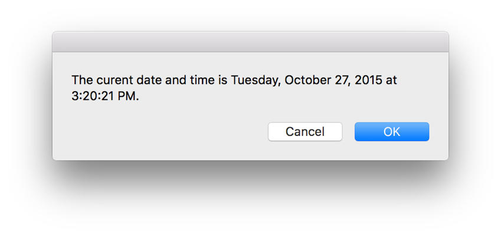
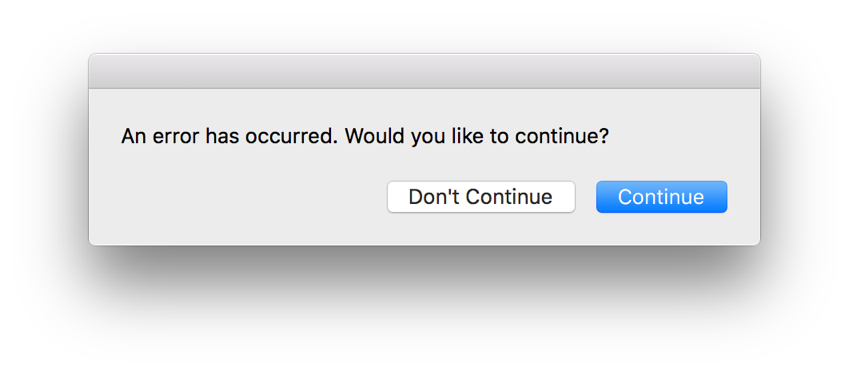
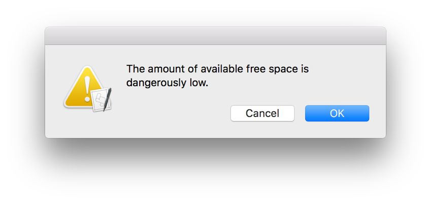
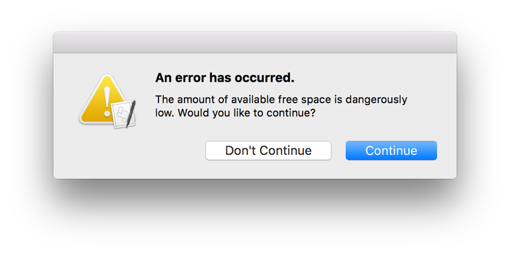

## Displaying Dialogs and Alerts

Dialogs and alerts are great ways to provide information about a script’s progress, report problems, and allow users to make decisions that affect script behavior.

### Displaying a Dialog

Use the `display dialog` command, provided by the Standard Additions scripting addition to show a basic dialog message to the user, such as the one in Figure 22-1. This dialog was produced by the code in Listing 22-1 and Listing 22-2. In these examples, a string is passed to the `display dialog` command as a direct parameter. The result of the command is the button the user clicked in the dialog.

**Figure 22-1**A simple dialog

**APPLESCRIPT**

[Open in Script Editor](applescript://com.apple.scripteditor?action=new&script=set%20theDialogText%20to%20%22The%20curent%20date%20and%20time%20is%20%22%20%26%20%28current%20date%29%20%26%20%22.%22%0Adisplay%20dialog%20theDialogText)

**Listing 22-1**AppleScript: Displaying a simple dialog

1. `set theDialogText to "The curent date and time is " & (current date) & "."`
2. `display dialog theDialogText`
3. `--> Result: {button returned:"OK"}`

**JAVASCRIPT**

[Open in Script Editor](applescript://com.apple.scripteditor?action=new&script=var%20app%20%3D%20Application.currentApplication%28%29%0Aapp.includeStandardAdditions%20%3D%20true%0A%0Avar%20dialogText%20%3D%20%22The%20current%20date%20and%20time%20is%20%22%20%2B%20%28app.currentDate%28%29%29%0Aapp.displayDialog%28dialogText%29)

**Listing 22-2**JavaScript: Displaying a simple dialog

1. `var app = Application.currentApplication()`
2. `app.includeStandardAdditions = true`
3. ` `
4. `var dialogText = "The current date and time is " + (app.currentDate())`
5. `app.displayDialog(dialogText)`
6. `// Result: {"buttonReturned":"OK"}`

> **Note**
>
>
> This chapter covers a portion of the `display dialog` command’s capabilities. For example, the `display dialog` command can also be used to collect text entered by the user. This is covered in [Prompting for Text](PromptforText.md#//apple_ref/doc/uid/TP40016239-CH80-SW1). For complete information about the `display dialog` command and its parameters, launch Script Editor, open the Standard Additions scripting addition’s dictionary, and navigate to the command’s definition.

### Customizing Dialog Buttons

By default, a dialog produced by the `display dialog` command has two buttons—Cancel and OK (the default). However, the command also has numerous optional parameters, some of which can be used to customize the buttons.

Use the `buttons` parameter to provide a list of between one and three buttons. You can optionally use the `default button` parameter to configure one as the default—it’s highlighted and pressing the Return key activates it to close the dialog. You can also use the `cancel button` parameter to configure one as the cancel button—pressing Escape or Command-Period (.) activates it to close the dialog and produce a user cancelled error.

The dialog shown in Figure 22-2 has been customized to include Don’t Continue (the cancel button) and Continue (the default) buttons. This dialog was produced by the example code in Listing 22-3 and Listing 22-4.

**Figure 22-2**A dialog with custom buttons

**APPLESCRIPT**

[Open in Script Editor](applescript://com.apple.scripteditor?action=new&script=set%20theDialogText%20to%20%22An%20error%20has%20occurred.%20Would%20you%20like%20to%20continue%3F%22%0Adisplay%20dialog%20theDialogText%20buttons%20%7B%22Don%27t%20Continue%22%2C%20%22Continue%22%7D%20default%20button%20%22Continue%22%20cancel%20button%20%22Don%27t%20Continue%22%0A)

**Listing 22-3**AppleScript: Displaying a dialog with custom buttons

1. `set theDialogText to "An error has occurred. Would you like to continue?"`
2. `display dialog theDialogText buttons {"Don't Continue", "Continue"} default button "Continue" cancel button "Don't Continue"`
3. `--> Result: {{button returned:"Continue"}`

**JAVASCRIPT**

[Open in Script Editor](applescript://com.apple.scripteditor?action=new&script=var%20app%20%3D%20Application.currentApplication%28%29%0Aapp.includeStandardAdditions%20%3D%20true%0A%0A%0Avar%20dialogText%20%3D%20%22An%20error%20has%20occurred.%20Would%20you%20like%20to%20continue%3F%22%0Aapp.displayDialog%28dialogText%2C%20%7B%0A%20%20%20%20buttons%3A%20%5B%22Don%27t%20Continue%22%2C%20%22Continue%22%5D%2C%0A%20%20%20%20defaultButton%3A%20%22Continue%22%2C%0A%20%20%20%20cancelButton%3A%20%22Don%27t%20Continue%22%0A%7D%29)

**Listing 22-4**JavaScript: Displaying a dialog with custom buttons

1. `var app = Application.currentApplication()`
2. `app.includeStandardAdditions = true`
3. ` `
4. ` `
5. `var dialogText = "An error has occurred. Would you like to continue?"`
6. `app.displayDialog(dialogText, {`
7. ` buttons: ["Don't Continue", "Continue"],`
8. ` defaultButton: "Continue",`
9. ` cancelButton: "Don't Continue"`
10. `})`
11. `// Result: {"buttonReturned":"Continue"}`

### Adding an Icon to a Dialog

Dialogs can also include an icon, providing users with a visual clue to their importance. You can direct the `display dialog` command to a specific icon by its file path, or resource name or ID if the icon is stored as a resource within your script’s bundle. You can also use the standard system icons `stop`, `note`, and `caution`. Listing 22-5 and Listing 22-6 display a dialog that includes the system caution icon like the one shown in Figure 22-3.

**Figure 22-3**A dialog with an icon

**APPLESCRIPT**

[Open in Script Editor](applescript://com.apple.scripteditor?action=new&script=set%20theDialogText%20to%20%22The%20amount%20of%20available%20free%20space%20is%20dangerously%20low.%22%0Adisplay%20dialog%20theDialogText%20with%20icon%20caution)

**Listing 22-5**AppleScript: Displaying a dialog with an icon

1. `set theDialogText to "The amount of available free space is dangerously low."`
2. `display dialog theDialogText with icon caution`

**JAVASCRIPT**

[Open in Script Editor](applescript://com.apple.scripteditor?action=new&script=var%20app%20%3D%20Application.currentApplication%28%29%0Aapp.includeStandardAdditions%20%3D%20true%0A%0Avar%20dialogText%20%3D%20%22The%20amount%20of%20available%20free%20space%20is%20dangerously%20low.%22%0Aapp.displayDialog%28dialogText%2C%20%7BwithIcon%3A%20%22caution%22%7D%29)

**Listing 22-6**JavaScript: Displaying a dialog with an icon

1. `var app = Application.currentApplication()`
2. `app.includeStandardAdditions = true`
3. ` `
4. `var dialogText = "The amount of available free space is dangerously low."`
5. `app.displayDialog(dialogText, {withIcon: "caution"})`

### Automatically Dismissing a Dialog

Sometimes, you may want to continue with script execution if a dialog isn’t dismissed by a user within a certain timeframe. In this case, you can specify an integer value for the `display dialog` command’s `giving up after` parameter, causing the dialog to *give up* and close automatically after a specified period of inactivity.

Listing 22-7 and Listing 22-8 display a dialog that automatically closes after five seconds of inactivity.

**APPLESCRIPT**

[Open in Script Editor](applescript://com.apple.scripteditor?action=new&script=display%20dialog%20%22Do%2C%20or%20do%20not.%20There%20is%20no%20try.%22%20giving%20up%20after%205)

**Listing 22-7**AppleScript: Displaying a dialog that automatically dismisses after a period of inactivity

1. `display dialog "Do, or do not. There is no try." giving up after 5`
2. `--> Result: {button returned:"OK", gave up:true}`

**JAVASCRIPT**

[Open in Script Editor](applescript://com.apple.scripteditor?action=new&script=var%20app%20%3D%20Application.currentApplication%28%29%0Aapp.includeStandardAdditions%20%3D%20true%0A%0Avar%20dialogText%20%3D%20%22Do%2C%20or%20do%20not.%20There%20is%20no%20try.%22%0Aapp.displayDialog%28dialogText%2C%20%7BgivingUpAfter%3A%205%7D%29)

**Listing 22-8**JavaScript: JavaScript a dialog that automatically dismisses after a period of inactivity

1. `var app = Application.currentApplication()`
2. `app.includeStandardAdditions = true`
3. ` `
4. `var dialogText = "Do, or do not. There is no try."`
5. `app.displayDialog(dialogText, {givingUpAfter: 5})`
6. `// Result: {"buttonReturned":"OK", "gaveUp":true}`

When using the `giving up after` parameter, the result of the `display dialog` command includes a `gaveUp` property, a Boolean value indicating whether the dialog was auto-dismissed. This information is useful if you want the script to take a different course of action based on whether a dialog is manually or automatically dismissed.

### Displaying an Alert

The `display alert` command is also provided by the Standard Additions scripting addition. It’s similar to the `display dialog` command, but with slightly different parameters. One of the `display alert` command’s optional parameters is `message`, which lets you provide additional text to display in a separate text field, below the bolded alert text. Listing 22-9 and Listing 22-10 show how to display the alert in Figure 22-4, which contains bolded alert text, plain message text, and custom buttons.

**Figure 22-4**An alert

**APPLESCRIPT**

[Open in Script Editor](applescript://com.apple.scripteditor?action=new&script=set%20theAlertText%20to%20%22An%20error%20has%20occurred.%22%0Aset%20theAlertMessage%20to%20%22The%20amount%20of%20available%20free%20space%20is%20dangerously%20low.%20Would%20you%20like%20to%20continue%3F%22%0Adisplay%20alert%20theAlertText%20message%20theAlertMessage%20as%20critical%20buttons%20%7B%22Don%27t%20Continue%22%2C%20%22Continue%22%7D%20default%20button%20%22Continue%22%20cancel%20button%20%22Don%27t%20Continue%22%0A)

**Listing 22-9**AppleScript: Displaying an alert with a message

1. `set theAlertText to "An error has occurred."`
2. `set theAlertMessage to "The amount of available free space is dangerously low. Would you like to continue?"`
3. `display alert theAlertText message theAlertMessage as critical buttons {"Don't Continue", "Continue"} default button "Continue" cancel button "Don't Continue"`
4. `--> Result: {button returned:"Continue"}`

**JAVASCRIPT**

[Open in Script Editor](applescript://com.apple.scripteditor?action=new&script=var%20app%20%3D%20Application.currentApplication%28%29%0Aapp.includeStandardAdditions%20%3D%20true%0A%0Avar%20alertText%20%3D%20%22An%20error%20has%20occurred.%22%0Avar%20alertMessage%20%3D%20%22The%20amount%20of%20available%20free%20space%20is%20dangerously%20low.%20Would%20you%20like%20to%20continue%3F%22%0Aapp.displayAlert%28alertText%2C%20%7B%0A%20%20%20%20message%3A%20alertMessage%2C%0A%20%20%20%20as%3A%20%22critical%22%2C%0A%20%20%20%20buttons%3A%20%5B%22Don%27t%20Continue%22%2C%20%22Continue%22%5D%2C%0A%20%20%20%20defaultButton%3A%20%22Continue%22%2C%0A%20%20%20%20cancelButton%3A%20%22Don%27t%20Continue%22%0A%7D%29)

**Listing 22-10**JavaScript: Displaying an alert with a message

1. `var app = Application.currentApplication()`
2. `app.includeStandardAdditions = true`
3. ` `
4. `var alertText = "An error has occurred."`
5. `var alertMessage = "The amount of available free space is dangerously low. Would you like to continue?"`
6. `app.displayAlert(alertText, {`
7. ` message: alertMessage,`
8. ` as: "critical",`
9. ` buttons: ["Don't Continue", "Continue"],`
10. ` defaultButton: "Continue",`
11. ` cancelButton: "Don't Continue"`
12. `})`
13. `// Result: {"buttonReturned":"OK"}`

> **Note**
>
>
> This chapter covers a portion of the `display alert` command’s capabilities. For complete information about the `display alert` command and its parameters, launch Script Editor, open the Standard Additions scripting addition’s dictionary, and navigate to the command’s definition.
