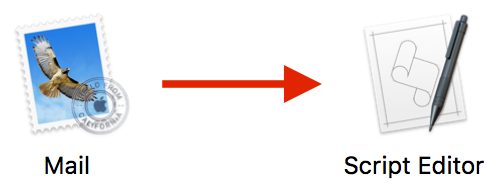
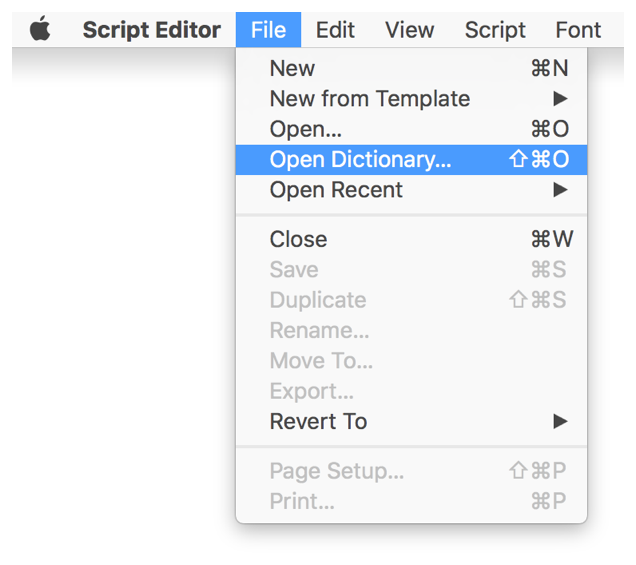
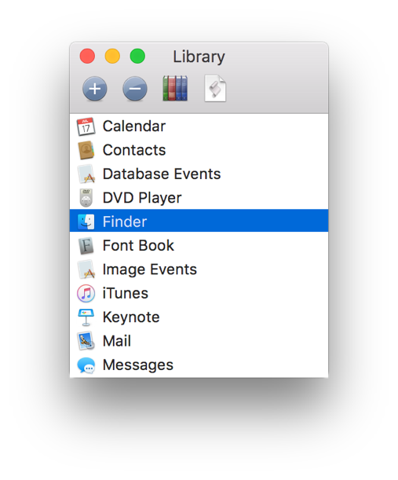
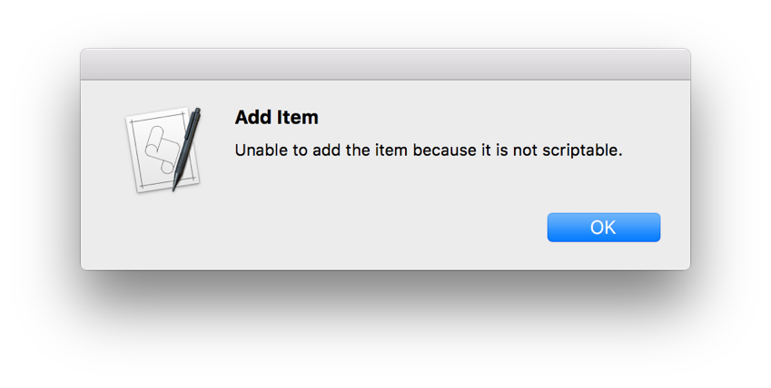

## Opening a Scripting Dictionary

Script Editor can open dictionaries and display their contents for you to consult while writing scripts.

**To open a scripting dictionary in Script Editor**

Do one of the following:

* Drag an app or scripting addition onto Script Editor in the Dock or in the Finder.

  

  
* Choose File > Open Dictionary (or press Shift-Command-O), and select a scriptable app or scripting addition.

  

  
* Double-click an app or scripting addition in the Library palette. If the Library palette isn’t visible, choose Window > Library (or press Shift-Command-L) to display it. Click the Add button (+) in the Library palette to add a new app or scripting addition to the list for quick access in the future.

  

  

An error message is displayed if you attempt to open an app without scripting terminology—a nonscriptable app.

