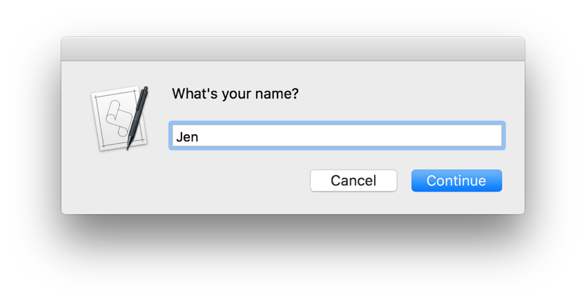
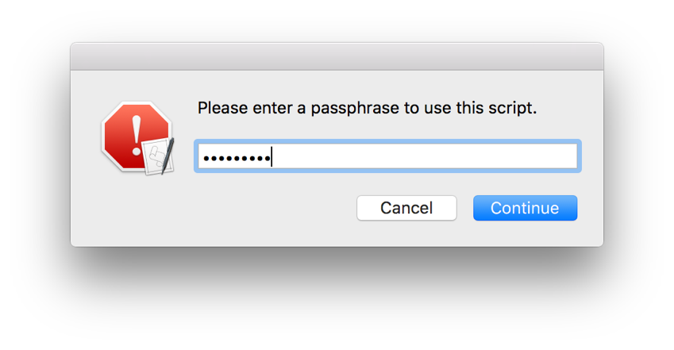

## Prompting for Text

Use the `display dialog` command’s optional `default answer` parameter to collect text, such as a username or email address, as your script runs. As demonstrated by Figure 23-1, Listing 23-1, and Listing 23-2, the inclusion of the `default answer` parameter automatically adds a text entry field to the resulting dialog. Any string you provide for the parameter appears in the text field when the dialog displays. Providing an empty string (`""`) produces an empty text field. When the dialog dismisses, any text from the field is returned in a `text returned` property of the `display dialog` command’s result.

**Figure 23-1**A dialog prompting for text input

**APPLESCRIPT**

[Open in Script Editor](applescript://com.apple.scripteditor?action=new&script=set%20theResponse%20to%20display%20dialog%20%22What%27s%20your%20name%3F%22%20default%20answer%20%22%22%20with%20icon%20note%20buttons%20%7B%22Cancel%22%2C%20%22Continue%22%7D%20default%20button%20%22Continue%22%0A--%3E%20%7Bbutton%20returned%3A%22Continue%22%2C%20text%20returned%3A%22Jen%22%7D%0Adisplay%20dialog%20%22Hello%2C%20%22%20%26%20%28text%20returned%20of%20theResponse%29%20%26%20%22.%22%0A)

**Listing 23-1**AppleScript: Prompting for text input

1. `set theResponse to display dialog "What's your name?" default answer "" with icon note buttons {"Cancel", "Continue"} default button "Continue"`
2. `--> {button returned:"Continue", text returned:"Jen"}`
3. `display dialog "Hello, " & (text returned of theResponse) & "."`

**JAVASCRIPT**

[Open in Script Editor](applescript://com.apple.scripteditor?action=new&script=var%20app%20%3D%20Application.currentApplication%28%29%0Aapp.includeStandardAdditions%20%3D%20true%0A%0Avar%20response%20%3D%20app.displayDialog%28%22What%27s%20your%20name%3F%22%2C%20%7B%0A%20%20%20%20defaultAnswer%3A%20%22%22%2C%0A%20%20%20%20withIcon%3A%20%22note%22%2C%0A%20%20%20%20buttons%3A%20%5B%22Cancel%22%2C%20%22Continue%22%5D%2C%0A%20%20%20%20defaultButton%3A%20%22Continue%22%0A%7D%29%0A%2F%2F%20Result%3A%20%7B%22buttonReturned%22%3A%22Continue%22%2C%20%22textReturned%22%3A%22Jen%22%7D%0Aapp.displayDialog%28%22Hello%2C%20%22%20%2B%20%28response.textReturned%29%20%2B%20%22.%22%29)

**Listing 23-2**JavaScript: Prompting for text input

1. `var app = Application.currentApplication()`
2. `app.includeStandardAdditions = true`
3. ` `
4. `var response = app.displayDialog("What's your name?", {`
5. ` defaultAnswer: "",`
6. ` withIcon: "note",`
7. ` buttons: ["Cancel", "Continue"],`
8. ` defaultButton: "Continue"`
9. `})`
10. `// Result: {"buttonReturned":"Continue", "textReturned":"Jen"}`
11. `app.displayDialog("Hello, " + (response.textReturned) + ".")`

> **Note**
>
>
> Additional information about the `display dialog` command can be found in [Displaying Dialogs and Alerts](DisplayDialogsandAlerts.md#//apple_ref/doc/uid/TP40016239-CH15-SW1). For complete information about the command and its parameters, launch Script Editor, open the Standard Additions scripting addition’s dictionary, and navigate to the command’s definition.

### Prompting for Hidden Text

Protect potentially sensitive information from prying eyes by using the `display dialog` command’s `default answer` parameter in conjunction with the `hidden answer` parameter to show bullets instead of plain text in the dialog’s text field. See Figure 23-2, Listing 23-3, and Listing 23-4.

**Figure 23-2**A dialog prompting for hidden text input

**APPLESCRIPT**

[Open in Script Editor](applescript://com.apple.scripteditor?action=new&script=display%20dialog%20%22Please%20enter%20a%20passphrase%20to%20use%20this%20script.%22%20default%20answer%20%22%22%20with%20icon%20stop%20buttons%20%7B%22Cancel%22%2C%20%22Continue%22%7D%20default%20button%20%22Continue%22%20with%20hidden%20answer%0A)

**Listing 23-3**AppleScript: Prompting for hidden text input

1. `display dialog "Please enter a passphrase to use this script." default answer "" with icon stop buttons {"Cancel", "Continue"} default button "Continue" with hidden answer`
2. `--> Result: {button returned:"Continue", text returned:"MySecretPassphrase"}`

**JAVASCRIPT**

[Open in Script Editor](applescript://com.apple.scripteditor?action=new&script=var%20app%20%3D%20Application.currentApplication%28%29%0Aapp.includeStandardAdditions%20%3D%20true%0A%0Aapp.displayDialog%28%22Please%20enter%20a%20passphrase%20to%20use%20this%20script.%22%2C%20%7B%0A%20%20%20%20defaultAnswer%3A%20%22%22%2C%0A%20%20%20%20withIcon%3A%20%22stop%22%2C%0A%20%20%20%20buttons%3A%20%5B%22Cancel%22%2C%20%22Continue%22%5D%2C%0A%20%20%20%20defaultButton%3A%20%22Continue%22%2C%0A%20%20%20%20hiddenAnswer%3A%20true%0A%7D%29)

**Listing 23-4**JavaScript: Prompting for hidden text input

1. `var app = Application.currentApplication()`
2. `app.includeStandardAdditions = true`
3. ` `
4. `app.displayDialog("Please enter a passphrase to use this script.", {`
5. ` defaultAnswer: "",`
6. ` withIcon: "stop",`
7. ` buttons: ["Cancel", "Continue"],`
8. ` defaultButton: "Continue",`
9. ` hiddenAnswer: true`
10. `})`
11. `// Result: {"buttonReturned":"Continue", "textReturned":"MySecretPassphrase"}`

Warning

Always be cautious when requesting sensitive data, such as passwords. Hidden text is returned by the `display dialog` command as plain, unencrypted text, so this command offers limited security.
