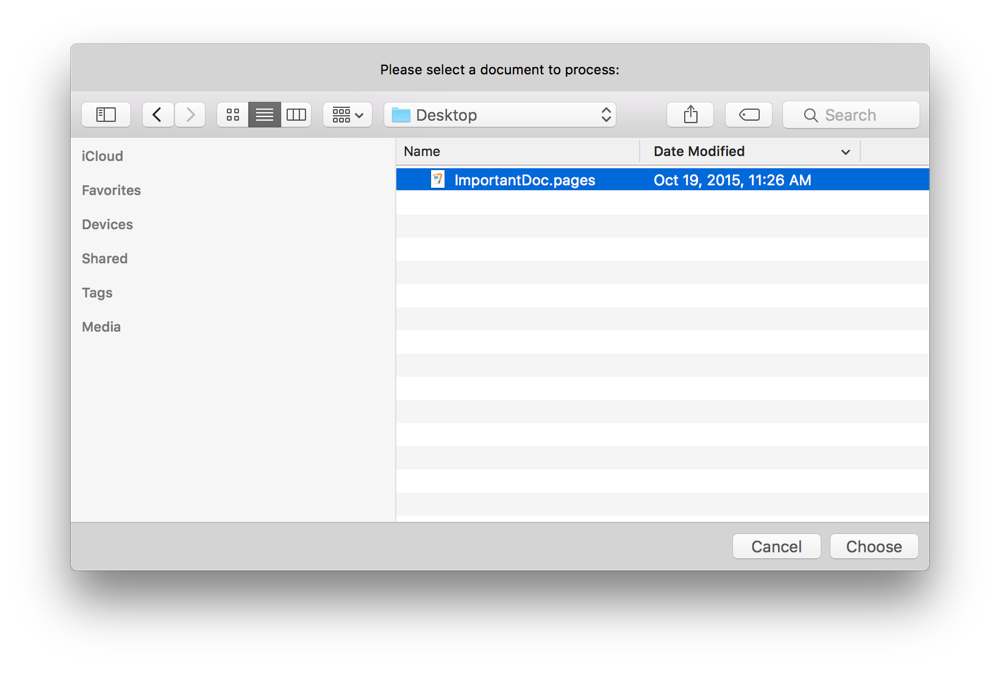
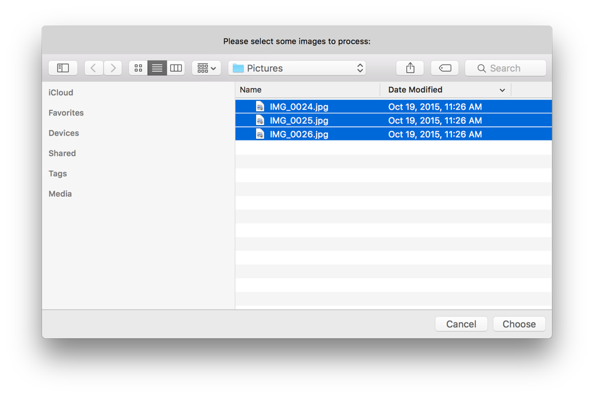
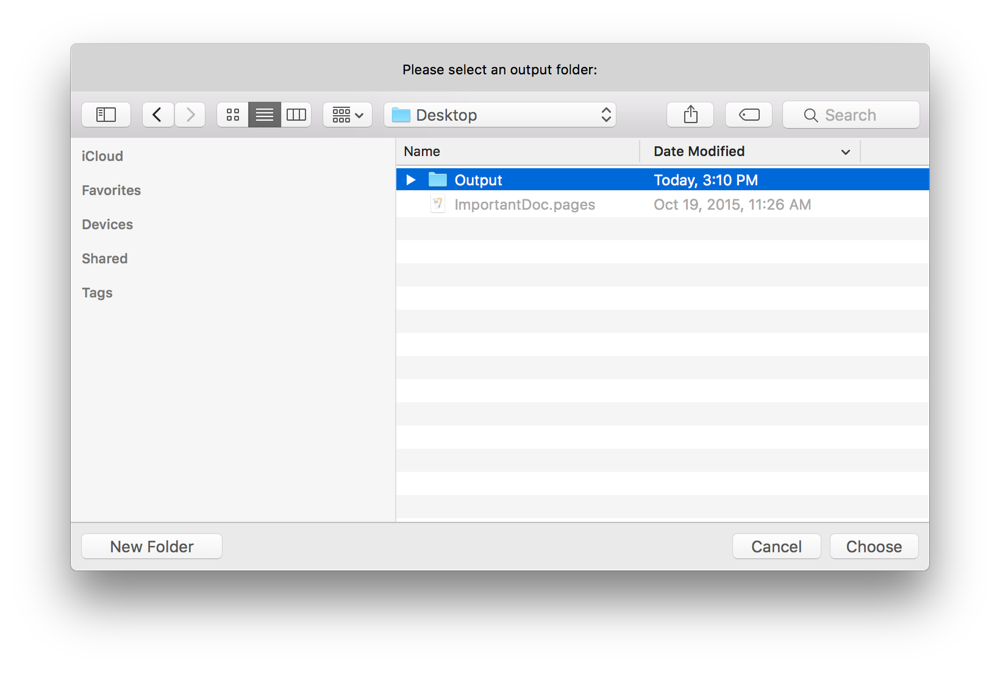

## Prompting for Files or Folders

It’s generally good practice to avoid hard-coding file and folder paths in a script. Prompting the user to select files and folders makes for a more dynamic script that won’t break when paths change.

### Prompting for a File

Use the Standard Additions scripting addition’s `choose file` command to prompt the user to select a file. Listing 26-1 and Listing 26-2 demonstrate how to use this command to display the simple file selection dialog with a custom prompt shown in Figure 26-1.

**Figure 26-1**Prompting for a file

**APPLESCRIPT**

[Open in Script Editor](applescript://com.apple.scripteditor?action=new&script=set%20theDocument%20to%20choose%20file%20with%20prompt%20%22Please%20select%20a%20document%20to%20process%3A%22)

**Listing 26-1**AppleScript: Prompting for a file

1. `set theDocument to choose file with prompt "Please select a document to process:"`
2. `--> Result: alias "Macintosh HD:Users:yourUserName:Documents:ImportantDoc.pages"`

**JAVASCRIPT**

[Open in Script Editor](applescript://com.apple.scripteditor?action=new&script=var%20app%20%3D%20Application.currentApplication%28%29%0Aapp.includeStandardAdditions%20%3D%20true%0A%0Avar%20document%20%3D%20app.chooseFile%28%7B%0A%20%20%20%20withPrompt%3A%20%22Please%20select%20a%20document%20to%20process%3A%22%0A%7D%29%0Adocument%0A)

**Listing 26-2**JavaScript: Prompting for a file

1. `var app = Application.currentApplication()`
2. `app.includeStandardAdditions = true`
3. ` `
4. `var document = app.chooseFile({`
5. ` withPrompt: "Please select a document to process:"`
6. `})`
7. `document`
8. `// Result: Path("/Users/yourUserName/Documents/ImportantDoc.pages")`

### Prompting for a Specific Type of File

If your script requires specific types of files for processing, you can use the `choose file` command’s optional `of type` parameter to provide a list of acceptable types. Types may be specified as extension strings without the leading period (such as `"jpg"` or `"png"`) or as uniform type identifiers (such as `"public.image"` or `"com.apple.iwork.pages.sffpages"`). Listing 26-3 and Listing 26-4 show how to prompt for an image.

**APPLESCRIPT**

[Open in Script Editor](applescript://com.apple.scripteditor?action=new&script=set%20theImage%20to%20choose%20file%20with%20prompt%20%22Please%20select%20an%20image%20to%20process%3A%22%20of%20type%20%7B%22public.image%22%7D)

**Listing 26-3**AppleScript: Prompting for an image

1. `set theImage to choose file with prompt "Please select an image to process:" of type {"public.image"}`
2. `--> Result: alias "Macintosh HD:Users:yourUserName:Pictures:IMG_0024.jpg"`

**JAVASCRIPT**

[Open in Script Editor](applescript://com.apple.scripteditor?action=new&script=var%20app%20%3D%20Application.currentApplication%28%29%0Aapp.includeStandardAdditions%20%3D%20true%0A%0Avar%20image%20%3D%20app.chooseFile%28%7B%0A%20%20%20%20withPrompt%3A%20%22Please%20select%20an%20image%20to%20process%3A%22%2C%0A%20%20%20%20ofType%3A%20%5B%22public.image%22%5D%0A%7D%29%0Aimage)

**Listing 26-4**JavaScript: Prompting for an image

1. `var app = Application.currentApplication()`
2. `app.includeStandardAdditions = true`
3. ` `
4. `var image = app.chooseFile({`
5. ` withPrompt: "Please select an image to process:",`
6. ` ofType: ["public.image"]`
7. `})`
8. `image`
9. `// Result: Path("/Users/yourUserName/Pictures/IMG_0024.jpg")`

### Prompting for Multiple Files

To let the user choose more than one file, include the `choose file` command’s optional `multiple selections allowed` parameter. Listing 26-5 and Listing 26-6 display a prompt asking for multiple images, as shown in Figure 26-2.

**Figure 26-2**Prompting for multiple images

**APPLESCRIPT**

[Open in Script Editor](applescript://com.apple.scripteditor?action=new&script=set%20theImages%20to%20choose%20file%20with%20prompt%20%22Please%20select%20some%20images%20to%20process%3A%22%20of%20type%20%7B%22public.image%22%7D%20with%20multiple%20selections%20allowed)

**Listing 26-5**AppleScript: Prompting for multiple images

1. `set theImages to choose file with prompt "Please select some images to process:" of type {"public.image"} with multiple selections allowed`
2. `--> Result: {alias "Macintosh HD:Users:yourUserName:Pictures:IMG_0024.jpg", alias "Macintosh HD:Users:yourUserName:Pictures:IMG_0025.jpg", alias "Macintosh HD:Users:yourUserName:Pictures:IMG_0026.jpg"}`

**JAVASCRIPT**

[Open in Script Editor](applescript://com.apple.scripteditor?action=new&script=var%20app%20%3D%20Application.currentApplication%28%29%0Aapp.includeStandardAdditions%20%3D%20true%0A%0Avar%20images%20%3D%20app.chooseFile%28%7B%0A%20%20%20%20withPrompt%3A%20%22Please%20select%20some%20images%20to%20process%3A%22%2C%0A%20%20%20%20ofType%3A%20%5B%22public.image%22%5D%2C%0A%20%20%20%20multipleSelectionsAllowed%3A%20true%0A%7D%29%0Aimages)

**Listing 26-6**JavaScript: Prompting for multiple images

1. `var app = Application.currentApplication()`
2. `app.includeStandardAdditions = true`
3. ` `
4. `var images = app.chooseFile({`
5. ` withPrompt: "Please select some images to process:",`
6. ` ofType: ["public.image"],`
7. ` multipleSelectionsAllowed: true`
8. `})`
9. `images`
10. `// Result: [Path("/Users/yourUserName/Pictures/IMG_0024.jpg"), Path("/Users/yourUserName/Pictures/IMG_0025.jpg"), Path("/Users/yourUserName/Pictures/IMG_0026.jpg")]`

### Prompting for a Folder

Use the Standard Additions scripting addition’s `choose folder` command to prompt the user to select a folder, such as an output folder or folder of images to process. Listing 26-7 and Listing 26-8 demonstrate how to use this command to display the simple folder selection dialog with a custom prompt shown in Figure 26-3.

**Figure 26-3**Prompting for a folder

**APPLESCRIPT**

[Open in Script Editor](applescript://com.apple.scripteditor?action=new&script=set%20theOutputFolder%20to%20choose%20folder%20with%20prompt%20%22Please%20select%20an%20output%20folder%3A%22)

**Listing 26-7**AppleScript: Prompting for a folder

1. `set theOutputFolder to choose folder with prompt "Please select an output folder:"`
2. `--> Result: alias "Macintosh HD:Users:yourUserName:Desktop:"`

**JAVASCRIPT**

[Open in Script Editor](applescript://com.apple.scripteditor?action=new&script=var%20app%20%3D%20Application.currentApplication%28%29%0Aapp.includeStandardAdditions%20%3D%20true%0A%0Avar%20outputFolder%20%3D%20app.chooseFolder%28%7B%0A%20%20%20%20withPrompt%3A%20%22Please%20select%20an%20output%20folder%3A%22%0A%7D%29%0AoutputFolder)

**Listing 26-8**JavaScript: Prompting for a folder

1. `var app = Application.currentApplication()`
2. `app.includeStandardAdditions = true`
3. ` `
4. `var outputFolder = app.chooseFolder({`
5. ` withPrompt: "Please select an output folder:"`
6. `})`
7. `outputFolder`
8. `// Result: Path("/Users/yourUserName/Desktop")`

### Prompting for Multiple Folders

To let the user choose more than one folder, include the `choose folder` command’s optional `multiple selections allowed` parameter, as shown in Listing 26-9 and Listing 26-10.

**APPLESCRIPT**

[Open in Script Editor](applescript://com.apple.scripteditor?action=new&script=set%20theFoldersToProcess%20to%20choose%20folder%20with%20prompt%20%22Please%20select%20the%20folders%20containing%20images%20to%20process%3A%22%20with%20multiple%20selections%20allowed)

**Listing 26-9**AppleScript: Prompting for multiple folders

1. `set theFoldersToProcess to choose folder with prompt "Please select the folders containing images to process:" with multiple selections allowed`
2. `--> Result: {alias "Macintosh HD:Users:yourUserName:Desktop:", alias "Macintosh HD:Users:yourUserName:Documents:"}`

**JAVASCRIPT**

[Open in Script Editor](applescript://com.apple.scripteditor?action=new&script=var%20app%20%3D%20Application.currentApplication%28%29%0Aapp.includeStandardAdditions%20%3D%20true%0A%0Avar%20foldersToProcess%20%3D%20app.chooseFolder%28%7B%0A%20%20%20%20withPrompt%3A%20%22Please%20select%20an%20output%20folder%3A%22%2C%0A%20%20%20%20multipleSelectionsAllowed%3A%20true%0A%7D%29%0AfoldersToProcess)

**Listing 26-10**JavaScript: Prompting for multiple folders

1. `var app = Application.currentApplication()`
2. `app.includeStandardAdditions = true`
3. ` `
4. `var foldersToProcess = app.chooseFolder({`
5. ` withPrompt: "Please select an output folder:",`
6. ` multipleSelectionsAllowed: true`
7. `})`
8. `foldersToProcess`
9. `// Result: [Path("/Users/yourUserName/Desktop"), Path("/Users/yourUserName/Documents")]`
