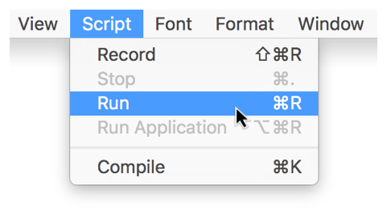

## Running a Script

Scripts can be opened and run in Script Editor and script applications can be run outside of Script Editor like any other OS X application. Some apps and tools, such as Automator and the systemwide script menu, can also run scripts.

### Running a Script in Script Editor

To run a script in Script Editor, click the Run button () in the toolbar, press Command-R, or choose Script > Run, as shown in Figure 8-1.

**Figure 8-1**Running a script in Script Editor

As the script runs, the Accessory View pane shows events and results of the script. This information can be useful for troubleshooting. See [Viewing Script Events and Results](GettoKnowScriptEditor.md#//apple_ref/doc/uid/TP40016239-CH5-SW6).

### Running a Script Application

To run a script application, double-click the script in the Finder, just like you would do to launch any other application. The script opens and begins running.

> **Note**
>
>
> When running a script app outside of Script Editor, you can’t view a list of the script’s events and results. To monitor this activity, open the app in Script Editor instead, run it, and check the Accessory View pane.
