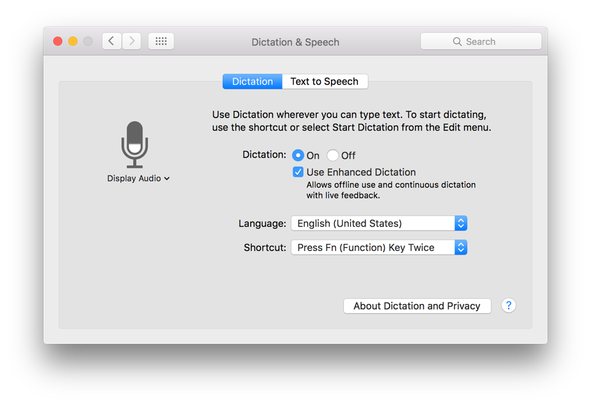
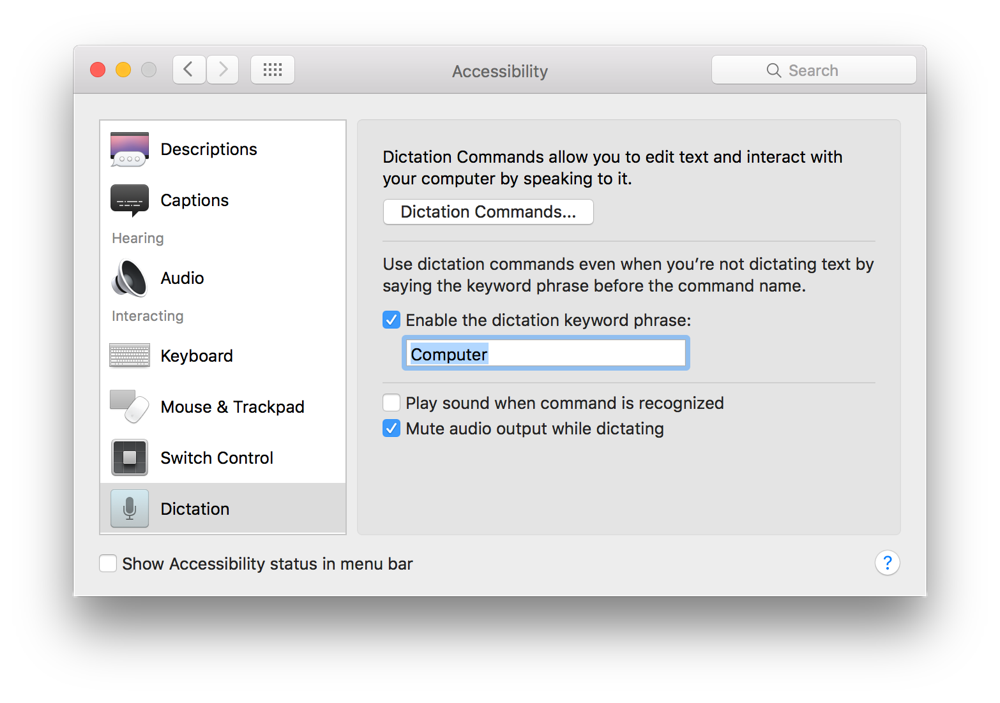
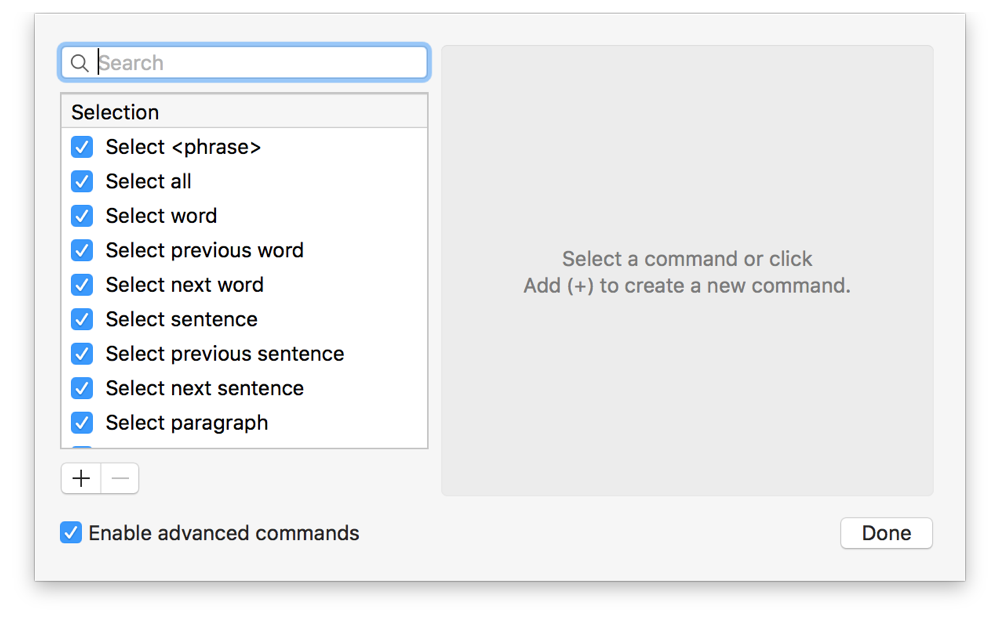
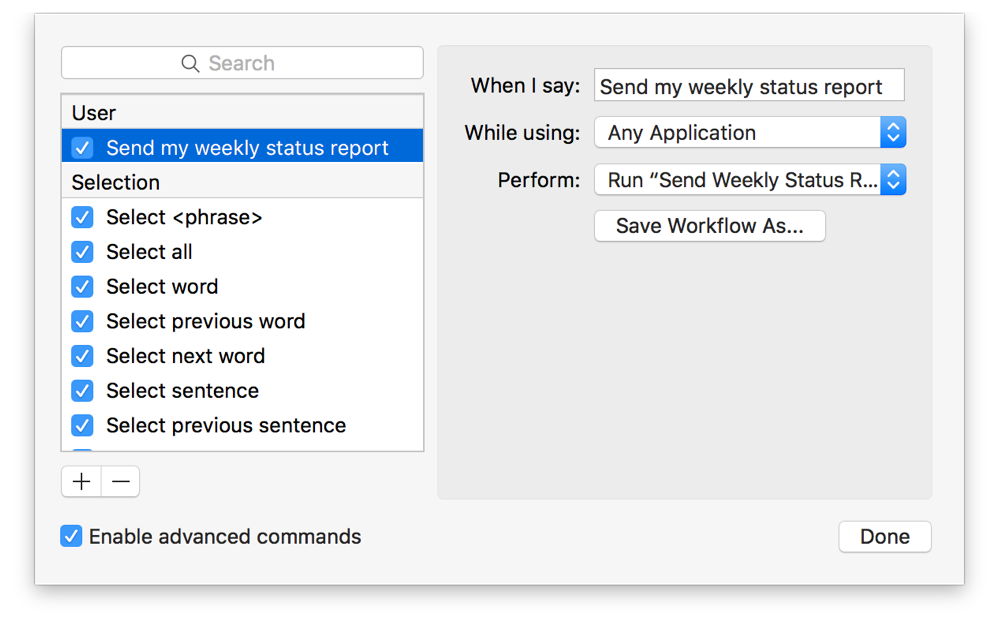
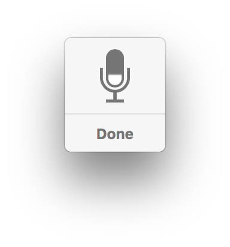
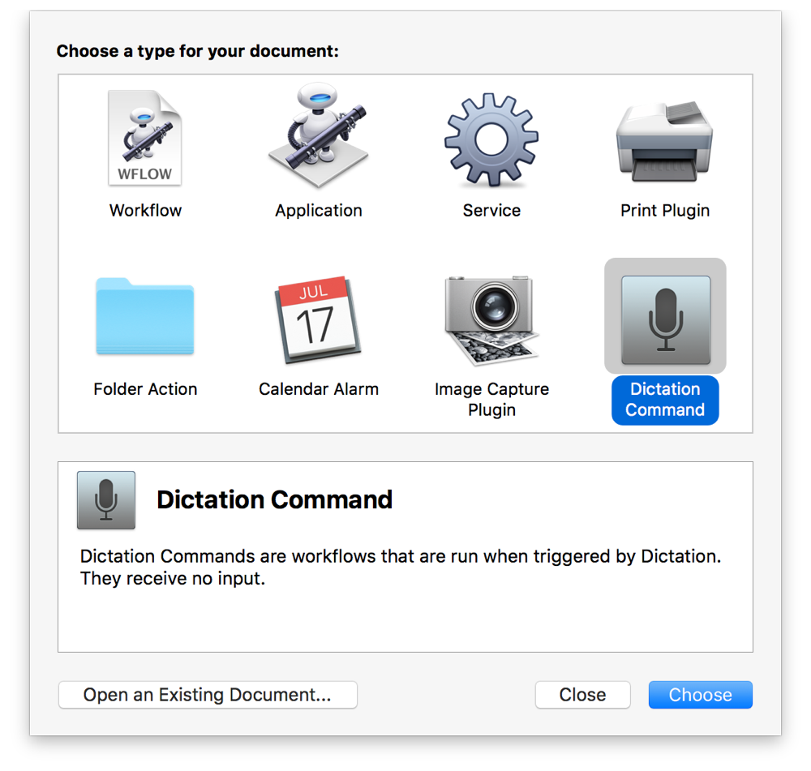
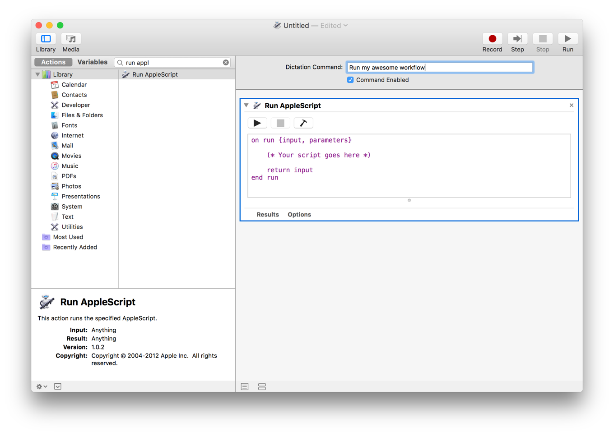

## Using Dictation to Run Scripts

Dictation commands is a powerful accessibility feature in OS X that lets you control your Mac using your voice. With dictation commands enabled, simply speak a command and watch it execute. The system comes with dozens of built-in dictation commands for opening apps, selecting menus, and more. You can extend the capabilities of dictation even further by creating your own custom commands using scripting and Automator.

### Enabling Dictation Commands

You must enable dictation commands before you can use them.

**To enable dictation commands to run scripts**

1. Launch System Preferences and open the Dictation & Speech preference pane.

   
2. Click the On radio button to enable dictation.
3. Click Use Enhanced Dictation.

   Enhanced dictation lets you perform dictation when your computer is offline, and is required to use dictation commands. Enabling this feature downloads some additional system content to your Mac.
4. Open the Accessibility preference pane.

   
5. In the list of accessibility features, click Dictation.
6. Click Dictation Commands.

   
7. Select the“Enabled advanced commands” checkbox.

### Creating a Dictation Command Script

Any script can serve as a dictation command. When the command is called, any code in the script’s `run` handler runs.

**To create a dictation command script**

1. Launch Script Editor and write a script that performs a task when run.
2. Save the script in script format to the `~/Library/Speech/Speakable Items/` folder in your Home directory.

   If you want the script to be available to other users on your Mac, save it to the `/Library/Speech/Speakable Items/` instead.
3. Launch System Preferences and open the Accessibility preference pane.
4. In the list of accessibility features, click Dictation.
5. Click Dictation Commands.

   
6. Click + to adde a new dictation command.
7. Enter a phrase to speak to invoke the script.
8. Choose the application context for triggering the command, such as Any Application, Mail, or Safari.
9. Choose Run Workflow > Other from the Perform pop-up menu.

   
10. Click Done.

### Running a Dictation Command Script

To run a dictation command—script or otherwise—press Fn key twice. When the dictation listener window (Figure 42-1) appears, say the name of the command you want to perform.

**Figure 42-1**Dictation listener window

Tip

To make dictation even easier, select the “Enable the dictation keyword phrase” checkbox and enter a phrase in System Preferences > Accessibility > Dictation. Once enabled, you don’t need to press the Fn key twice anymore to trigger a command. Instead, just say the keyword phrase, followed by the name of the command. For example, if your keyword phrase is `Computer`, you might say “Computer, send my weekly status report.”

### Creating a Dictation Command Automator Workflow

Automator can also be used to create dictation commands.

**To create a dictation command Automator workflow**

1. Launch Automator.
2. Click Dictation Command in the template selection dialog.

   
3. Add actions to the workflow.

   The Run AppleScript, Run JavaScript, and Run Shell Script actions can be used to initiate scripts from your workflow.
4. At the top of the workflow, enter a dictation command and select the Command Enabled checkbox.

   
5. Save the workflow and name it.

> **Note**
>
>
> Automator dictation commands are automatically saved in the `~/Library/Speech/Speakable Items/` folder in your Home directory.
