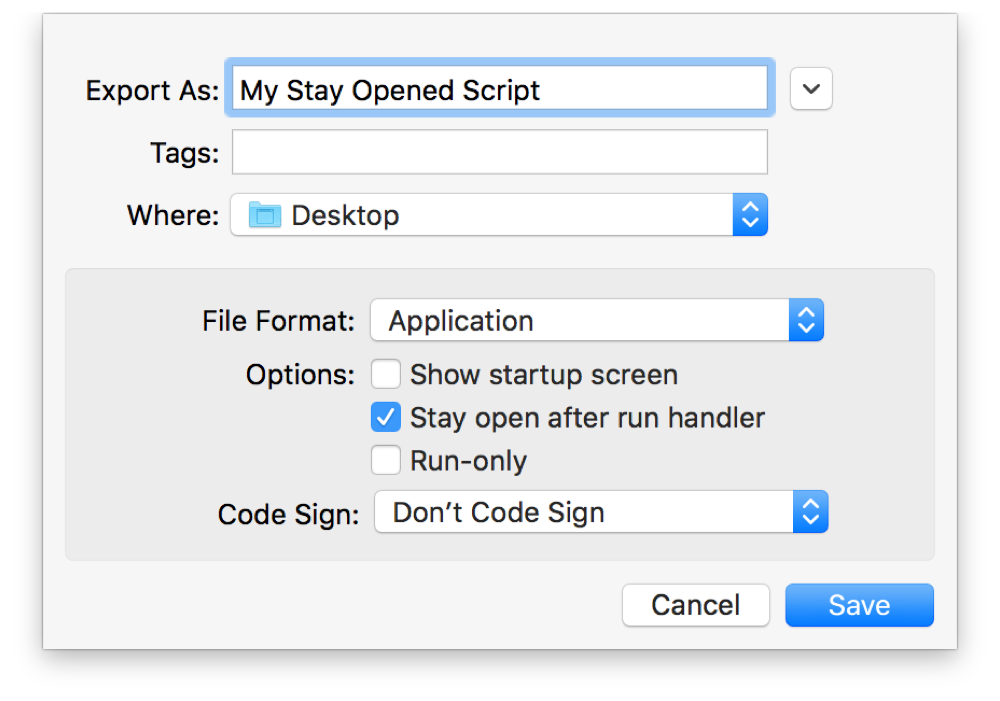

## Using Handlers/Functions

Collections of script statements that can be invoked by name are referred to as *handlers* in AppleScript, *functions* or *methods* in JavaScript, and *subroutines* in some other languages. Throughout this document, these terms are used interchangeably.

Handlers are generally written to perform a task multiple times throughout a script, such as displaying an alert, writing text to a file, or creating an email message. Instead of inserting the same code over and over, you write it once and give it a name. You can name a handler whatever you like as long as the name contains no special characters, such as punctuation, or spaces, and isn’t a reserved language term. You then `call`, or evoke, a handler whenever necessary by referring to it by name. Each time you do, any code in the handler runs. Handlers can optionally be written to receive information as input for processing (*parameters*), and can return information as output (*result* or *return value*).

Handlers provide a way to organize your code by breaking it up into smaller, manageable, modular chunks. This can be useful when troubleshooting; you can narrow in on a single handler to resolve a problem, rather than sorting through a long, complex script. It also makes future script updates easier, as you can change behavior in one place to affect an entire script.

> **Note**
>
>
> AppleScript handlers are generally placed at the end of a script, while in JavaScript, they’re usually placed at the top.

### AppleScript Handlers

In AppleScript, a handler begins with the word `on` or `to`, followed by the handler name and its parameters, if any. It ends with the word `end`, followed by the handler name. AppleScript handlers can be written with positional, labeled, or interleaved parameters.

Listing 13-1 shows a simple one-line script that displays a hypothetical error message, which you might want to display numerous times as a script runs.

**APPLESCRIPT**

[Open in Script Editor](applescript://com.apple.scripteditor?action=new&script=display%20dialog%20%22The%20script%20encountered%20a%20problem.%22)

**Listing 13-1**AppleScript: A simple script that displays an error message

1. `display dialog "The script encountered a problem."`

In Listing 13-1, the code from Listing 13-1 has been converted to a handler named `displayError`, which has no parameters.

**APPLESCRIPT**

[Open in Script Editor](applescript://com.apple.scripteditor?action=new&script=on%20displayError%28%29%0A%20%20%20%20display%20dialog%20%22The%20script%20encountered%20a%20problem.%22%0Aend%20displayError)

**Listing 13-2**AppleScript: A simple handler that displays an error message

1. `on displayError()`
2. ` display dialog "The script encountered a problem."`
3. `end displayError`

Listing 13-3 shows a variation of the handler in Listing 13-1, which uses the `to` prefix instead of `on`. Either syntax is acceptable.

**APPLESCRIPT**

[Open in Script Editor](applescript://com.apple.scripteditor?action=new&script=to%20displayError%28%29%0A%20%20%20%20display%20dialog%20%22The%20script%20encountered%20a%20problem.%22%0Aend%20displayError)

**Listing 13-3**AppleScript: A variation of a simple handler that displays an error message

1. `to displayError()`
2. ` display dialog "The script encountered a problem."`
3. `end displayError`

You can now call the `displayError` handler any time you want to display an error, as shown in Listing 13-4.

**APPLESCRIPT**

[Open in Script Editor](applescript://com.apple.scripteditor?action=new&script=try%0A%20%20%20%20--%20Do%20something%0Aon%20error%0A%20%20%20%20--%20Notify%20the%20user%20that%20there%27s%20a%20problem%0A%20%20%20%20displayError%28%29%0Aend%20try%0A%0Atry%0A%20%20%20%20--%20Do%20something%20else%0Aon%20error%0A%20%20%20%20--%20Notify%20the%20user%20that%20there%27s%20a%20problem%0A%20%20%20%20displayError%28%29%0Aend%20try)

**Listing 13-4**AppleScript: Calling a simple handler to display an error message

1. `try`
2. ` -- Do something`
3. `on error`
4. ` -- Notify the user that there's a problem`
5. ` displayError()`
6. `end try`
7. ` `
8. `try`
9. ` -- Do something else`
10. `on error`
11. ` -- Notify the user that there's a problem`
12. ` displayError()`
13. `end try`

For detailed information about AppleScript handlers, see [About Handlers](../../../AppleScript/Conceptual/AppleScriptLangGuide/conceptual/ASLR_about_handlers.html#//apple_ref/doc/uid/TP40000983-CH206) and [Handler Reference](../../../AppleScript/Conceptual/AppleScriptLangGuide/reference/ASLR_handlers.html#//apple_ref/doc/uid/TP40000983-CH7g) in *[AppleScript Language Guide](../../../AppleScript/Conceptual/AppleScriptLangGuide/introduction/ASLR_intro.html#//apple_ref/doc/uid/TP40000983)*.

> **Note**
>
>
> To call a handler from within a `tell` statement, you must use the reserved words `of me` or `my`, as shown in Listing 13-5.
>
> **APPLESCRIPT**
>
> [Open in Script Editor](applescript://com.apple.scripteditor?action=new&script=tell%20application%20%22Finder%22%0A%20%20%20%20try%0A%20%20%20%20%20%20%20%20--%20Do%20something%0A%20%20%20%20on%20error%0A%20%20%20%20%20%20%20%20--%20Notify%20the%20user%20that%20there%27s%20a%20problem%0A%20%20%20%20%20%20%20%20displayError%28%29%20of%20me%0A%20%20%20%20end%20try%0Aend%20tell%0A%0A%0Atell%20application%20%22Finder%22%0A%20%20%20%20try%0A%20%20%20%20%20%20%20%20--%20Do%20something%20else%0A%20%20%20%20on%20error%0A%20%20%20%20%20%20%20%20--%20Notify%20the%20user%20that%20there%27s%20a%20problem%0A%20%20%20%20%20%20%20%20my%20displayError%28%29%0A%20%20%20%20end%20try%0Aend%20tell)
>
> **Listing 13-5**AppleScript: Calling a handler from within a tell statement
>
> 1. `tell application "Finder"`
> 2. ` try`
> 3. ` -- Do something`
> 4. ` on error`
> 5. ` -- Notify the user that there's a problem`
> 6. ` displayError() of me`
> 7. ` end try`
> 8. `end tell`
> 9. ` `
> 10. ` `
> 11. `tell application "Finder"`
> 12. ` try`
> 13. ` -- Do something else`
> 14. ` on error`
> 15. ` -- Notify the user that there's a problem`
> 16. ` my displayError()`
> 17. ` end try`
> 18. `end tell`

### AppleScript Handlers with Positional Parameters

Positional parameters are a series of comma-separated variables, contained within parentheses, following the handler name. In Listing 13-6, the `displayError` handler from Listing 13-1 has been updated to accept two positional parameters—an error message and a list of buttons to display.

**APPLESCRIPT**

[Open in Script Editor](applescript://com.apple.scripteditor?action=new&script=on%20displayError%28theErrorMessage%2C%20theButtons%29%0A%20%20%20%20display%20dialog%20theErrorMessage%20buttons%20theButtons%0Aend%20displayError)

**Listing 13-6**AppleScript: A handler that displays a specified error message with custom buttons

1. `on displayError(theErrorMessage, theButtons)`
2. ` display dialog theErrorMessage buttons theButtons`
3. `end displayError`

To call the handler, refer to it by name and provide a value for each positional parameter, as shown in Listing 13-7. The order of these values should match the parameter positions in the handler definition.

**APPLESCRIPT**

[Open in Script Editor](applescript://com.apple.scripteditor?action=new&script=displayError%28%22There%27s%20not%20enough%20available%20space.%20Would%20you%20like%20to%20continue%3F%22%2C%20%7B%22Don%27t%20Continue%22%2C%20%22Continue%22%7D%29)

**Listing 13-7**AppleScript: Calling a handler to display a specified error message with custom buttons

1. `displayError("There's not enough available space. Would you like to continue?", {"Don't Continue", "Continue"})`

For additional information about this style of handler, see [Handlers with Positional Parameters](../../../AppleScript/Conceptual/AppleScriptLangGuide/conceptual/ASLR_about_handlers.html#//apple_ref/doc/uid/TP40000983-CH206-SW13) in *[AppleScript Language Guide](../../../AppleScript/Conceptual/AppleScriptLangGuide/introduction/ASLR_intro.html#//apple_ref/doc/uid/TP40000983)*.

### AppleScript Handlers with Interleaved Parameters

Interleaved parameters are a variation of positional parameters, in which the parameter name is split into pieces and interleaved with parameters using colons and spaces. Listing 13-8 shows how the handler from Listing 13-6 can be represented using interleaved parameters.

**APPLESCRIPT**

[Open in Script Editor](applescript://com.apple.scripteditor?action=new&script=tell%20me%20to%20displayError%3A%22There%27s%20not%20enough%20available%20space.%20Would%20you%20like%20to%20continue%3F%22%20withButtons%3A%7B%22Don%27t%20Continue%22%2C%20%22Continue%22%7D%0A%0Aon%20displayError%3AtheErrorMessage%20withButtons%3AtheButtons%0A%20%20%20%20display%20dialog%20theErrorMessage%20buttons%20theButtons%0Aend%20displayError%3AwithButtons%3A)

**Listing 13-8**AppleScript: Example of a handler with interleaved parameters

1. `tell me to displayError:"There's not enough available space. Would you like to continue?" withButtons:{"Don't Continue", "Continue"}`
2. ` `
3. `on displayError:theErrorMessage withButtons:theButtons`
4. ` display dialog theErrorMessage buttons theButtons`
5. `end displayError:withButtons:`

Interleaved parameters resemble Objective-C syntax. Therefore, they are typically used to call Objective-C methods in AppleScriptObjC scripts.

[Objective-C to AppleScript Quick Translation Guide](AppendixA-AppleScriptObjCQuickTranslationGuide.md#//apple_ref/doc/uid/TP40016239-CH79-SW1) discusses interleaved parameter use in AppleScriptObjC scripts. For additional information about this style of handler, see [Handlers with Interleaved Parameters](../../../AppleScript/Conceptual/AppleScriptLangGuide/conceptual/ASLR_about_handlers.html#//apple_ref/doc/uid/TP40000983-CH206-SW2) in *[AppleScript Language Guide](../../../AppleScript/Conceptual/AppleScriptLangGuide/introduction/ASLR_intro.html#//apple_ref/doc/uid/TP40000983)*.

### AppleScript Handlers with Labeled Parameters

AppleScript also supports labeled parameters, although this style is rarely used when defining custom handlers. Most often, it’s a style used for event handlers. See [Event Handlers](#//apple_ref/doc/uid/TP40016239-CH52-SW17). Listing 13-9 shows how the `displayError` handler might appear if it were written using the labeled parameter style.

**APPLESCRIPT**

[Open in Script Editor](applescript://com.apple.scripteditor?action=new&script=display%20of%20%22There%27s%20not%20enough%20available%20space.%20Would%20you%20like%20to%20continue%3F%22%20over%20%7B%22Don%27t%20Continue%22%2C%20%22Continue%22%7D%0A%0Ato%20display%20of%20theErrorMessage%20over%20theButtons%0A%20%20%20%20display%20dialog%20theErrorMessage%20buttons%20theButtons%0Aend%20display)

**Listing 13-9**AppleScript: Example of a handler with labeled parameters

1. `display of "There's not enough available space. Would you like to continue?" over {"Don't Continue", "Continue"}`
2. ` `
3. `to display of theErrorMessage over theButtons`
4. ` display dialog theErrorMessage buttons theButtons`
5. `end display`

For additional information about this style of handler, see [Handlers with Labeled Parameters](../../../AppleScript/Conceptual/AppleScriptLangGuide/conceptual/ASLR_about_handlers.html#//apple_ref/doc/uid/TP40000983-CH206-SW22) in *[AppleScript Language Guide](../../../AppleScript/Conceptual/AppleScriptLangGuide/introduction/ASLR_intro.html#//apple_ref/doc/uid/TP40000983)*.

### JavaScript Functions

In JavaScript, a function name is preceded by the word `function` and followed by a list of parameters, if any. The function’s contents are contained within curly braces (`{ ... }`).

Listing 13-10 shows a simple script that displays a hypothetical error message.

**JAVASCRIPT**

[Open in Script Editor](applescript://com.apple.scripteditor?action=new&script=var%20app%20%3D%20Application.currentApplication%28%29%0Aapp.includeStandardAdditions%20%3D%20true%0A%0Afunction%20displayError%28%29%20%7B%0A%20%20%20%20app.displayDialog%28%22The%20script%20encountered%20a%20problem.%22%29%0A%7D)

**Listing 13-10**JavaScript: A simple function that displays an error message

1. `var app = Application.currentApplication()`
2. `app.includeStandardAdditions = true`
3. ` `
4. `function displayError() {`
5. ` app.displayDialog("The script encountered a problem.")`
6. `}`

You can now call the `displayError` function any time you want to display an error, as shown in Listing 13-11.

**JAVASCRIPT**

[Open in Script Editor](applescript://com.apple.scripteditor?action=new&script=try%20%7B%0A%20%20%20%20%2F%2F%20Do%20something%0A%7D%20catch%20%28error%29%20%7B%0A%20%20%20%20%2F%2F%20Notify%20the%20user%20that%20there%27s%20a%20problem%0A%20%20%20%20displayError%28%29%0A%7D%0A%0Atry%20%7B%0A%20%20%20%20%2F%2F%20Do%20something%20else%0A%7D%20catch%20%28error%29%20%7B%0A%20%20%20%20%2F%2F%20Notify%20the%20user%20that%20there%27s%20a%20problem%0A%20%20%20%20displayError%28%29%0A%7D)

**Listing 13-11**JavaScript: Calling a simple function to display an error message

1. `try {`
2. ` // Do something`
3. `} catch (error) {`
4. ` // Notify the user that there's a problem`
5. ` displayError()`
6. `}`
7. ` `
8. `try {`
9. ` // Do something else`
10. `} catch (error) {`
11. ` // Notify the user that there's a problem`
12. ` displayError()`
13. `}`

### Using Parameters

JavaScript functions are written with positional parameters, comma-separated variables, contained within parentheses, following the function name. In Listing 13-12, the `displayError` function from Listing 13-10 has been updated to accept two positional parameters—an error message and a list of buttons to display.

**JAVASCRIPT**

[Open in Script Editor](applescript://com.apple.scripteditor?action=new&script=var%20app%20%3D%20Application.currentApplication%28%29%0Aapp.includeStandardAdditions%20%3D%20true%0A%0Afunction%20displayError%28errorMessage%2C%20buttons%29%20%7B%0A%20%20%20%20app.displayDialog%28errorMessage%2C%20%7B%0A%20%20%20%20%20%20%20%20buttons%3A%20buttons%0A%20%20%20%20%7D%29%0A%7D)

**Listing 13-12**JavaScript: A function that displays a specified error message with custom buttons

1. `var app = Application.currentApplication()`
2. `app.includeStandardAdditions = true`
3. ` `
4. `function displayError(errorMessage, buttons) {`
5. ` app.displayDialog(errorMessage, {`
6. ` buttons: buttons`
7. ` })`
8. `}`

To call the function, refer to it by name and provide a value for each positional parameter, as shown in Listing 13-13. The order of these values should match the parameter positions in the function definition.

**JAVASCRIPT**

[Open in Script Editor](applescript://com.apple.scripteditor?action=new&script=displayError%28%22There%27s%20not%20enough%20available%20space.%20Would%20you%20like%20to%20continue%3F%22%2C%20%5B%22Don%27t%20Continue%22%2C%20%22Continue%22%5D%29)

**Listing 13-13**JavaScript: Calling a function to display a specified error message with custom buttons

1. `displayError("There's not enough available space. Would you like to continue?", ["Don't Continue", "Continue"])`

### Exiting Handlers and Returning a Result

Often, handlers are used to process information and produce a result for further processing. To enable this functionality, add the `return` command, followed by a value to provide, to the handler. In Listing 13-14 and Listing 13-15, the `displayError` handler returns a Boolean value, indicating whether processing should continue after an error has occurred.

**APPLESCRIPT**

[Open in Script Editor](applescript://com.apple.scripteditor?action=new&script=set%20shouldContinueProcessing%20to%20displayError%28%22There%27s%20not%20enough%20available%20space.%20Would%20you%20like%20to%20continue%3F%22%29%0Aif%20shouldContinueProcessing%20%3D%20true%20then%0A%20%20%20%20--%20Continue%20processing%20%20%20%20%0Aelse%0A%20%20%20%20--%20Stop%20processing%0Aend%20if%0A%0Aon%20displayError%28theErrorMessage%29%0A%20%20%20%20set%20theResponse%20to%20display%20dialog%20theErrorMessage%20buttons%20%7B%22Don%27t%20Continue%22%2C%20%22Continue%22%7D%20default%20button%20%22Continue%22%0A%20%20%20%20set%20theButtonChoice%20to%20button%20returned%20of%20theResponse%0A%20%20%20%20if%20theButtonChoice%20%3D%20%22Continue%22%20then%0A%20%20%20%20%20%20%20%20return%20true%0A%20%20%20%20else%0A%20%20%20%20%20%20%20%20return%20false%0A%20%20%20%20end%20if%0Aend%20displayError)

**Listing 13-14**AppleScript: Returning a value from a handler

1. `set shouldContinueProcessing to displayError("There's not enough available space. Would you like to continue?")`
2. `if shouldContinueProcessing = true then`
3. ` -- Continue processing`
4. `else`
5. ` -- Stop processing`
6. `end if`
7. ` `
8. `on displayError(theErrorMessage)`
9. ` set theResponse to display dialog theErrorMessage buttons {"Don't Continue", "Continue"} default button "Continue"`
10. ` set theButtonChoice to button returned of theResponse`
11. ` if theButtonChoice = "Continue" then`
12. ` return true`
13. ` else`
14. ` return false`
15. ` end if`
16. `end displayError`

**JAVASCRIPT**

[Open in Script Editor](applescript://com.apple.scripteditor?action=new&script=var%20app%20%3D%20Application.currentApplication%28%29%0Aapp.includeStandardAdditions%20%3D%20true%0A%0Afunction%20displayError%28errorMessage%29%20%7B%0A%20%20%20%20var%20response%20%3D%20app.displayDialog%28errorMessage%2C%20%7B%0A%20%20%20%20%20%20%20%20buttons%3A%20%5B%22Don%27t%20Continue%22%2C%20%22Continue%22%5D%2C%0A%20%20%20%20%20%20%20%20defaultButton%3A%20%22Continue%22%0A%20%20%20%20%7D%29%0A%20%20%20%20var%20buttonChoice%20%3D%20response.buttonReturned%0A%20%20%20%20if%20%28buttonChoice%20%3D%3D%20%22Continue%22%29%0A%20%20%20%20%20%20%20%20return%20true%0A%20%20%20%20else%0A%20%20%20%20%20%20%20%20return%20false%0A%7D%0A%0Avar%20shouldContinueProcessing%20%3D%20displayError%28%22There%27s%20not%20enough%20available%20space.%20Would%20you%20like%20to%20continue%3F%22%29%0Aif%20%28shouldContinueProcessing%29%20%7B%0A%20%20%20%20%2F%2F%20Continue%20processing%0A%7D%20else%20%7B%0A%20%20%20%20%2F%2F%20Stop%20processing%0A%7D%0A)

**Listing 13-15**JavaScript: Returning a value from a function

1. `var app = Application.currentApplication()`
2. `app.includeStandardAdditions = true`
3. ` `
4. `function displayError(errorMessage) {`
5. ` var response = app.displayDialog(errorMessage, {`
6. ` buttons: ["Don't Continue", "Continue"],`
7. ` defaultButton: "Continue"`
8. ` })`
9. ` var buttonChoice = response.buttonReturned`
10. ` if (buttonChoice == "Continue")`
11. ` return true`
12. ` else`
13. ` return false`
14. `}`
15. ` `
16. `var shouldContinueProcessing = displayError("There's not enough available space. Would you like to continue?")`
17. `if (shouldContinueProcessing) {`
18. ` // Continue processing`
19. `} else {`
20. ` // Stop processing`
21. `}`

> **Note**
>
>
> You can return a value at any time within a handler, not just at the end.

### Event Handlers

Some apps, including scripts themselves, can call handlers when certain events occur, such as when launched or quit. In Mail, you can set up a rule to look for incoming emails matching certain criteria. When a matching email is detected, Mail can call a handler in a specified script to process the email. Handlers like these are considered *event handlers* or *command handlers*.

Listing 13-16 shows an example of a Mail rule event handler. It receives any detected messages as input, and can loop through them to process them.

**APPLESCRIPT**

[Open in Script Editor](applescript://com.apple.scripteditor?action=new&script=using%20terms%20from%20application%20%22Mail%22%0A%20%20%20%20on%20perform%20mail%20action%20with%20messages%20theDetectedMessages%20for%20rule%20theRule%0A%20%20%20%20%20%20%20%20tell%20application%20%22Mail%22%0A%20%20%20%20%20%20%20%20%20%20%20%20set%20theMessageCount%20to%20count%20of%20theDetectedMessages%0A%20%20%20%20%20%20%20%20%20%20%20%20repeat%20with%20a%20from%201%20to%20theMessageCount%0A%20%20%20%20%20%20%20%20%20%20%20%20%20%20%20%20set%20theCurrentMessage%20to%20item%20a%20of%20theDetectedMessages%0A%20%20%20%20%20%20%20%20%20%20%20%20%20%20%20%20--%20Process%20the%20message%0A%20%20%20%20%20%20%20%20%20%20%20%20end%20repeat%0A%20%20%20%20%20%20%20%20end%20tell%0A%20%20%20%20end%20perform%20mail%20action%20with%20messages%0Aend%20using%20terms%20from)

**Listing 13-16**AppleScript: Example of a Mail rule event handler

1. `using terms from application "Mail"`
2. ` on perform mail action with messages theDetectedMessages for rule theRule`
3. ` tell application "Mail"`
4. ` set theMessageCount to count of theDetectedMessages`
5. ` repeat with a from 1 to theMessageCount`
6. ` set theCurrentMessage to item a of theDetectedMessages`
7. ` -- Process the message`
8. ` end repeat`
9. ` end tell`
10. ` end perform mail action with messages`
11. `end using terms from`

### Script Event Handlers

As previously mentioned, scripts can contain event handlers too. These handlers run when certain events occur.

### Run Handlers

The `run` event handler is called when a script runs. By default, any executable code at the top level of a script—that is, not contained within a handler or `script` object—is considered to be contained within an implicit `run` handler. See Listing 13-17 and Listing 13-18.

**APPLESCRIPT**

[Open in Script Editor](applescript://com.apple.scripteditor?action=new&script=display%20dialog%20%22The%20script%20is%20running.%22)

**Listing 13-17**AppleScript: Example of an implicitly defined `run` handler

1. `display dialog "The script is running."`

**JAVASCRIPT**

[Open in Script Editor](applescript://com.apple.scripteditor?action=new&script=var%20app%20%3D%20Application.currentApplication%28%29%0Aapp.includeStandardAdditions%20%3D%20true%0Aapp.displayDialog%28%22The%20script%20is%20running.%22%29)

**Listing 13-18**JavaScript: Example of an implicitly defined `run` function

1. `var app = Application.currentApplication()`
2. `app.includeStandardAdditions = true`
3. `app.displayDialog("The script is running.")`

Optionally, the `run` handler can be explicitly defined. Listing 13-19 and Listing 13-20 produce the exact same behavior as Listing 13-17 and Listing 13-18.

**APPLESCRIPT**

[Open in Script Editor](applescript://com.apple.scripteditor?action=new&script=on%20run%0A%20%20%20%20display%20dialog%20%22The%20script%20is%20running.%22%0Aend%20run)

**Listing 13-19**AppleScript: Example of an explicitly defined `run` handler

1. `on run`
2. ` display dialog "The script is running."`
3. `end run`

**JAVASCRIPT**

[Open in Script Editor](applescript://com.apple.scripteditor?action=new&script=function%20run%28%29%20%7B%0A%20%20%20%20var%20app%20%3D%20Application.currentApplication%28%29%0A%20%20%20%20app.includeStandardAdditions%20%3D%20true%0A%20%20%20%20app.displayDialog%28%22The%20script%20is%20running.%22%29%0A%7D)

**Listing 13-20**JavaScript: Example of an explicitly defined `run` function

1. `function run() {`
2. ` var app = Application.currentApplication()`
3. ` app.includeStandardAdditions = true`
4. ` app.displayDialog("The script is running.")`
5. `}`

### Quit Handlers

The `quit` event handler is optional, and is called when a script app quits. Use this as an opportunity to perform cleanup tasks, if necessary, such as removing temporary folders or logging progress. Listing 13-21 and Listing 13-22 demonstrate the use of a `quit` handler.

**APPLESCRIPT**

[Open in Script Editor](applescript://com.apple.scripteditor?action=new&script=on%20quit%0A%20%20%20%20display%20dialog%20%22The%20script%20is%20quitting.%22%0Aend%20quit)

**Listing 13-21**AppleScript: Example of a `quit` handler

1. `on quit`
2. ` display dialog "The script is quitting."`
3. `end quit`

**JAVASCRIPT**

[Open in Script Editor](applescript://com.apple.scripteditor?action=new&script=var%20app%20%3D%20Application.currentApplication%28%29%0Aapp.includeStandardAdditions%20%3D%20true%0A%0Afunction%20quit%28%29%20%7B%0A%20%20%20%20app.displayDialog%28%22The%20script%20is%20quitting.%22%29%0A%7D)

**Listing 13-22**JavaScript: Example of a `quit` function

1. `var app = Application.currentApplication()`
2. `app.includeStandardAdditions = true`
3. ` `
4. `function quit() {`
5. ` app.displayDialog("The script is quitting.")`
6. `}`

### Open Handlers

The inclusion of an `open` handler or `openDocuments` method in a script app automatically makes the app drag-and-droppable. When launched in this way, the `open` handler receives a dropped list of files or folders as a direct parameter, as shown in Listing 13-23 and Listing 13-24.

**APPLESCRIPT**

[Open in Script Editor](applescript://com.apple.scripteditor?action=new&script=on%20open%20theDroppedItems%0A%20%20%20%20--%20Process%20the%20dropped%20items%20here%0Aend%20open)

**Listing 13-23**AppleScript: Structure of an `open` handler

1. `on open theDroppedItems`
2. ` -- Process the dropped items here`
3. `end open`

**JAVASCRIPT**

[Open in Script Editor](applescript://com.apple.scripteditor?action=new&script=function%20openDocuments%28droppedItems%29%20%7B%0A%20%20%20%20%2F%2F%20Process%20the%20dropped%20items%20here%0A%7D)

**Listing 13-24**JavaScript: Structure of an `openDocuments` function

1. `function openDocuments(droppedItems) {`
2. ` // Process the dropped items here`
3. `}`

For detailed information about using the `open` handler to create drop scripts, see [Processing Dropped Files and Folders](ProcessDroppedFilesandFolders.md#//apple_ref/doc/uid/TP40016239-CH53-SW1).

### Idle Handlers

When saving a script, you can optionally save it as a stay-open application. See Figure 13-1. In a stay-open script app, the script stays open after the `run` handler completes, and an `idle` handler is called every 30 seconds. Use the `idle` handler to perform periodic processing tasks, such as checking a watched folder for new files to process. To change the duration between `idle` calls, return a new duration, in seconds, as the result of the `idle` handler. Listing 13-25 and Listing 13-26 demonstrate an `idle` handler that delays for five seconds between executions.

**Figure 13-1**Saving a stay-open script

**APPLESCRIPT**

[Open in Script Editor](applescript://com.apple.scripteditor?action=new&script=on%20idle%0A%20%20%20%20display%20dialog%20%22The%20script%20is%20idling.%22%0A%20%20%20%20return%205%0Aend%20idle)

**Listing 13-25**AppleScript: Example of an `idle` handler

1. `on idle`
2. ` display dialog "The script is idling."`
3. ` return 5`
4. `end idle`

**JAVASCRIPT**

[Open in Script Editor](applescript://com.apple.scripteditor?action=new&script=var%20app%20%3D%20Application.currentApplication%28%29%0Aapp.includeStandardAdditions%20%3D%20true%0A%0Afunction%20idle%28%29%20%7B%0A%20%20%20%20app.displayDialog%28%22The%20script%20is%20idling.%22%29%0A%20%20%20%20return%205%0A%7D)

**Listing 13-26**JavaScript: Example of an `idle` function

1. `var app = Application.currentApplication()`
2. `app.includeStandardAdditions = true`
3. ` `
4. `function idle() {`
5. ` app.displayDialog("The script is idling.")`
6. ` return 5`
7. `}`

For information about using the `idle` handler for folder watching, see [Watching Folders](WatchFolders.md#//apple_ref/doc/uid/TP40016239-CH39-SW1).
