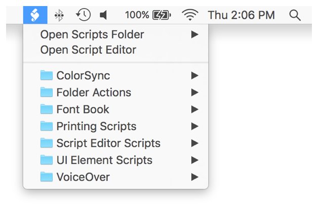

## Using the Systemwide Script Menu

The OS X script menu provides quick access to your collection of scripts. Simply select a script in the menu at any time to run it instantly. Within the script menu, scripts can be organized into subfolders and by application. See Figure 41-1.

**Figure 41-1**The OS X script menu

> **Note**
>
>
> The script menu can run compiled scripts, as well as scripts saved as apps. It can also run UNIX shell scripts and Automator workflows.

### Enabling the Script Menu

The script menu is disabled by default in OS X.

**To enable the script menu**

1. Launch Script Editor, located in `/Applications/Utilities/`.
2. Select Script Editor > Preferences, or press Command-Comma (,), to open the preferences window.
3. Click General in the toolbar.
4. Enable the “Show Script menu in menu bar” checkbox.
5. Choose whether application scripts—scripts that appear only when a corresponding app is in the front—should appear at the top or bottom of the script menu.

   

Tip

The script menu displays scripts in the `~/Library/Scripts/` folder of your user directory. To include scripts at the computer-level (in the `/Library/Scripts/` folder), enable the “Show Computer scripts” checkbox.

### Adding User-Level Scripts to the Script Menu

User-level scripts are scripts that only you can see and use. They aren’t available to other users on your Mac.

To add user-level scripts to the script menu, save them into the `~/Library/Scripts/` folder of your user directory. For quick access to this folder, select Open Scripts Folder > Open User Scripts Folder from the script menu. When you do this, the folder is automatically created if it doesn’t already exist.

### Adding Computer-Level Scripts to the Script Menu

Computer-level scripts are scripts that any user on your Mac can see and use.

To add computer-level scripts to the script menu, save them into the `/Library/Scripts/` folder on your Mac. For quick access to this folder, select Open Scripts Folder > Open Computer Scripts Folder from the script menu. When you do this, the folder is automatically created if it doesn’t already exist.

### Adding Application-Specific Scripts to the Script Menu

Application-specific scripts are only visible in the script menu when a specific app is in the front.

To add application-specific scripts to the script menu, save them into the `~/Library/Scripts/Applications/«ApplicationName»` folder in your user directory or the `/Library/Scripts/Applications/«ApplicationName»` folder on your Mac. For quick access to this folder, bring the app to the front, then select Open Scripts Folder > Open «ApplicationName» Scripts Folder from the script menu. When you do this, a folder for the application is automatically created if it doesn’t already exist.

### Running Scripts in the Script Menu

Select a script from the script menu to run it. If the script is an application, it launches and runs normally. If the script is a compiled script, a progress indicator appears in the menu bar. See Figure 41-2.

**Figure 41-2**Script menu progress

> **Note**
>
>
> To reveal a script in the script menu, select it in the menu while pressing the Shift key.
>
> To open a script menu script in Script Editor, select it in the menu while pressing the Option key.
