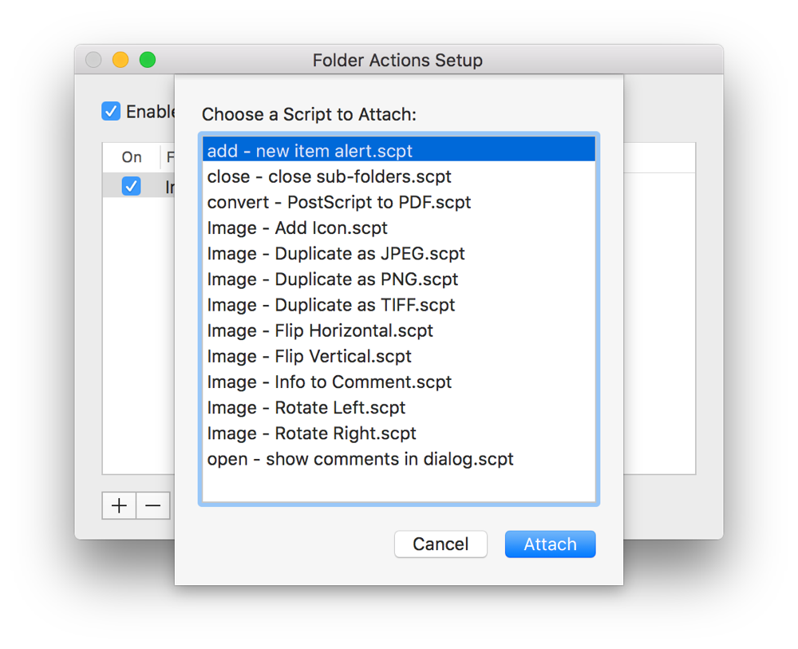
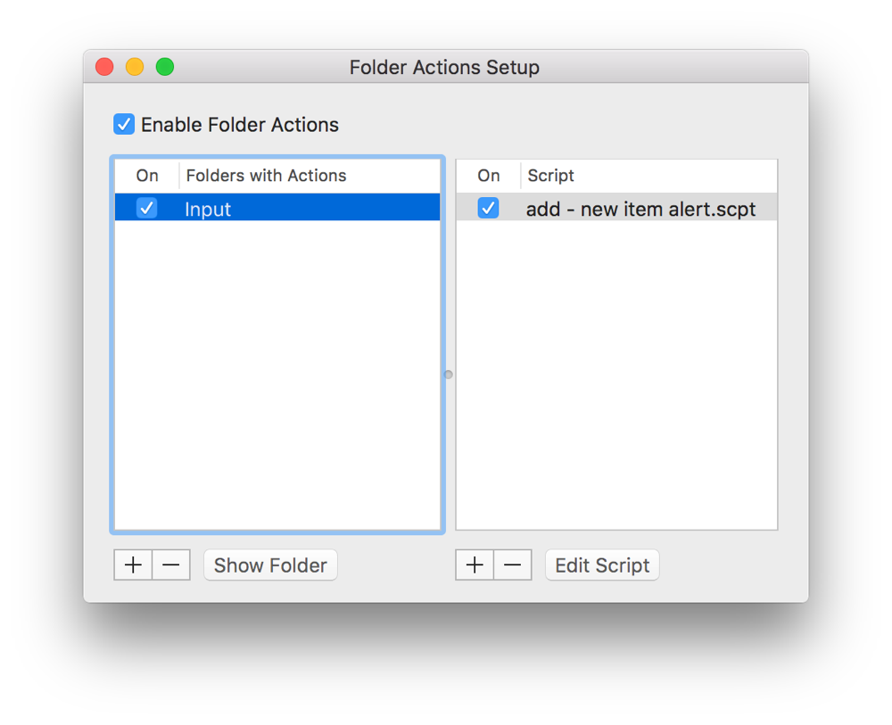

## Watching Folders

The ability to watch folders and take action on incoming items is a powerful automation technique that enables the creation of fully unattended workflows. A watched folder might be used, for example, to watermark incoming photos, convert them to PDF, and email them to clients for review. Many companies set up script servers—dedicated robot machines that watch folders and process detected items, allowing employees to offload tedious and repetitious work in order to focus on other important tasks.

In OS X, there are two primary ways to set up scripting-based watched folders: folder actions and stay open script apps.

### Using Folder Actions to Watch Folders

Folder actions is a feature in OS X that lets you connect scripts to folders on your Mac. A folder action script includes one or more event handlers that run in response to certain events, such as opening, closing, or adding items to the connected folder. With folder actions, you can create automated workflows that:

* Notify you when new files and folders arrive in a folder
* Notify you when existing files and folders are removed from a folder
* Perform processing of newly detected files and folders
* Initiate any automated task when a new file or folder is detected
* Adjust or reset the view properties of a folder’s window when it’s opened, closed, or resized

### Write a Folder Action Script

The event handlers supported by folder actions are defined in the Standard Additions scripting addition that comes with OS X. They are:

| Folder event | Event handler | Parameters |
| --- | --- | --- |
| Items—files or folders—are added to the folder | `adding folder items to` | Direct parameter—The connected folder. `after receiving`—A list of items added to the folder. |
| Items are removed from the folder | `removing folder items from` | Direct parameter—The connected folder. `after losing`—A list of items removed from the folder. For items that were deleted, names of the removed items are provided. |
| The folder is opened in a new Finder window | `opening folder` | Direct parameter—The connected folder. |
| The window of a folder is closed | `closing folder window for` | Direct parameter—The connected folder. |
| The window of a folder is moved | `moving folder window for` | Direct parameter—The connected folder. `from`—The coordinates of the folder’s window before it was moved. |

**To create a folder action script**

1. Create a Script Editor document.
2. Add one or more folder action event handlers to the document.
3. Save the document as a compiled script to one of the following folders:

   * `/Library/Scripts/Folder Action Scripts/`—The script can be used by any user.
   * `~/Library/Scripts/Folder Action Scripts/`—The script can be used by the current user only.

The following examples demonstrate how to use different folder action event handlers.

**APPLESCRIPT**

[Open in Script Editor](applescript://com.apple.scripteditor?action=new&script=on%20opening%20folder%20theAttachedFolder%0A%20%20%20%20--%20Get%20the%20name%20of%20the%20attached%20folder%0A%20%20%20%20tell%20application%20%22Finder%22%0A%20%20%20%20%20%20%20%20set%20theName%20to%20name%20of%20theAttachedFolder%0A%0A%20%20%20%20%20%20%20%20--%20Display%20an%20alert%20indicating%20that%20the%20folder%20was%20opened%0A%20%20%20%20%20%20%20%20activate%0A%20%20%20%20%20%20%20%20display%20alert%20%22Attention!%22%20message%20%22The%20folder%20%22%20%26%20%28quoted%20form%20of%20theName%29%20%26%20%22%20was%20opened.%22%0A%20%20%20%20end%20tell%0Aend%20opening%20folder)

**Listing 18-1**AppleScript: Example of the `opening folder` event handler

1. `on opening folder theAttachedFolder`
2. ` -- Get the name of the attached folder`
3. ` tell application "Finder"`
4. ` set theName to name of theAttachedFolder`
5. ` `
6. ` -- Display an alert indicating that the folder was opened`
7. ` activate`
8. ` display alert "Attention!" message "The folder " & (quoted form of theName) & " was opened."`
9. ` end tell`
10. `end opening folder`

**APPLESCRIPT**

[Open in Script Editor](applescript://com.apple.scripteditor?action=new&script=on%20closing%20folder%20window%20for%20theAttachedFolder%0A%20%20%20%20--%20Get%20the%20name%20of%20the%20attached%20folder%0A%20%20%20%20tell%20application%20%22Finder%22%0A%20%20%20%20%20%20%20%20set%20theName%20to%20name%20of%20theAttachedFolder%0A%0A%20%20%20%20%20%20%20%20--%20Display%20an%20alert%20indicating%20that%20the%20folder%20was%20closed%0A%20%20%20%20%20%20%20%20activate%0A%20%20%20%20%20%20%20%20display%20alert%20%22Attention!%22%20message%20%22The%20folder%20%22%20%26%20%28quoted%20form%20of%20theName%29%20%26%20%22%20was%20closed.%22%0A%20%20%20%20end%20tell%0Aend%20closing%20folder%20window%20for)

**Listing 18-2**AppleScript: Example of the `closing folder window for` event handler

1. `on closing folder window for theAttachedFolder`
2. ` -- Get the name of the attached folder`
3. ` tell application "Finder"`
4. ` set theName to name of theAttachedFolder`
5. ` `
6. ` -- Display an alert indicating that the folder was closed`
7. ` activate`
8. ` display alert "Attention!" message "The folder " & (quoted form of theName) & " was closed."`
9. ` end tell`
10. `end closing folder window for`

**APPLESCRIPT**

[Open in Script Editor](applescript://com.apple.scripteditor?action=new&script=on%20adding%20folder%20items%20to%20theAttachedFolder%20after%20receiving%20theNewItems%0A%20%20%20%20--%20Get%20the%20name%20of%20the%20attached%20folder%0A%20%20%20%20tell%20application%20%22Finder%22%0A%20%20%20%20%20%20%20%20set%20theName%20to%20name%20of%20theAttachedFolder%0A%0A%20%20%20%20%20%20%20%20--%20Count%20the%20new%20items%0A%20%20%20%20%20%20%20%20set%20theCount%20to%20length%20of%20theNewItems%0A%0A%20%20%20%20%20%20%20%20--%20Display%20an%20alert%20indicating%20that%20the%20new%20items%20were%20received%0A%20%20%20%20%20%20%20%20activate%0A%20%20%20%20%20%20%20%20display%20alert%20%22Attention!%22%20message%20%28theCount%20%26%20%22%20new%20items%20were%20detected%20in%20folder%20%22%20%26%20%28quoted%20form%20of%20theName%29%20%26%20%22.%22%20as%20string%29%0A%0A%20%20%20%20%20%20%20%20--%20Loop%20through%20the%20newly%20detected%20items%0A%20%20%20%20%20%20%20%20repeat%20with%20anItem%20in%20theNewItems%0A%0A%20%20%20%20%20%20%20%20%20%20%20%20--%20Process%20the%20current%20item%0A%0A%20%20%20%20%20%20%20%20%20%20%20%20--%20Move%20the%20current%20item%20to%20another%20folder%20so%20it%27s%20not%20processed%20again%20in%20the%20future%0A%0A%20%20%20%20%20%20%20%20end%20repeat%0A%20%20%20%20end%20tell%0Aend%20adding%20folder%20items%20to)

**Listing 18-3**AppleScript: Example of the `adding folder items to` event handler

1. `on adding folder items to theAttachedFolder after receiving theNewItems`
2. ` -- Get the name of the attached folder`
3. ` tell application "Finder"`
4. ` set theName to name of theAttachedFolder`
5. ` `
6. ` -- Count the new items`
7. ` set theCount to length of theNewItems`
8. ` `
9. ` -- Display an alert indicating that the new items were received`
10. ` activate`
11. ` display alert "Attention!" message (theCount & " new items were detected in folder " & (quoted form of theName) & "." as string)`
12. ` `
13. ` -- Loop through the newly detected items`
14. ` repeat with anItem in theNewItems`
15. ` `
16. ` -- Process the current item`
17. ` `
18. ` -- Move the current item to another folder so it's not processed again in the future`
19. ` `
20. ` end repeat`
21. ` end tell`
22. `end adding folder items to`

**APPLESCRIPT**

[Open in Script Editor](applescript://com.apple.scripteditor?action=new&script=on%20removing%20folder%20items%20from%20theAttachedFolder%20after%20losing%20theRemovedItems%0A%20%20%20%20--%20Get%20the%20name%20of%20the%20attached%20folder%0A%20%20%20%20tell%20application%20%22Finder%22%0A%20%20%20%20%20%20%20%20set%20theName%20to%20name%20of%20theAttachedFolder%0A%0A%20%20%20%20%20%20%20%20--%20Count%20the%20removed%20items%0A%20%20%20%20%20%20%20%20set%20theCount%20to%20length%20of%20theRemovedItems%0A%0A%20%20%20%20%20%20%20%20--%20Display%20an%20alert%20indicating%20that%20items%20were%20removed%0A%20%20%20%20%20%20%20%20activate%0A%20%20%20%20%20%20%20%20display%20alert%20%22Attention!%22%20message%20%28theCount%20%26%20%22%20items%20were%20removed%20from%20folder%20%22%20%26%20%28quoted%20form%20of%20theName%29%20%26%20%22.%22%20as%20string%29%0A%0A%20%20%20%20%20%20%20%20--%20Loop%20through%20the%20removed%20items%2C%20performing%20any%20additional%20tasks%0A%20%20%20%20%20%20%20%20repeat%20with%20anItem%20in%20theRemovedItems%0A%0A%20%20%20%20%20%20%20%20%20%20%20%20--%20Process%20the%20current%20item%0A%0A%20%20%20%20%20%20%20%20end%20repeat%0A%20%20%20%20end%20tell%0Aend%20removing%20folder%20items%20from)

**Listing 18-4**AppleScript: Example of the `removing folder items from` event handler

1. `on removing folder items from theAttachedFolder after losing theRemovedItems`
2. ` -- Get the name of the attached folder`
3. ` tell application "Finder"`
4. ` set theName to name of theAttachedFolder`
5. ` `
6. ` -- Count the removed items`
7. ` set theCount to length of theRemovedItems`
8. ` `
9. ` -- Display an alert indicating that items were removed`
10. ` activate`
11. ` display alert "Attention!" message (theCount & " items were removed from folder " & (quoted form of theName) & "." as string)`
12. ` `
13. ` -- Loop through the removed items, performing any additional tasks`
14. ` repeat with anItem in theRemovedItems`
15. ` `
16. ` -- Process the current item`
17. ` `
18. ` end repeat`
19. ` end tell`
20. `end removing folder items from`

### Attaching a Folder Action Script to a Folder

A folder action script must be connected to a folder in order to use it. This is done with Folder Actions Setup, an app that’s launched from the Finder’s contextual menu.

**To attach a folder action script to a folder**

1. Control-click the folder in Finder.
2. Choose Folder Actions Setup from the contextual menu.

   The Folder Actions Setup app launches, the folder is automatically added to the Folders with Actions list, and you’re prompted to select a script.
3. Choose a script to connect to the folder and click Attach.

   
4. Make sure the Enable Folder Actions checkbox is selected, as well as the On checkboxes next to the folder.

   

Once the script and folder are connected, the folder action event handlers in the script should run when the corresponding actions occur.

> **Note**
>
>
> Folder Actions Setup can also be used to disable or remove folder action scripts and watched folders.
>
> The Folder Actions Setup app itself resides in `/System/Library/CoreServices/`.

### Watching Folders Using an Idle Loop and a Stay Open Script App

Although folder actions provide efficient folder watching capabilities, some scripters prefer to implement customized folder watching workflows that provide more control over the folder watching process. This is typically done by creating a stay-open script with an `idle` handler that checks a folder at regular intervals for new items to process. Listing 18-5 demonstrates an `idle` handler-based script that watches an Input folder on the Desktop.

**APPLESCRIPT**

[Open in Script Editor](applescript://com.apple.scripteditor?action=new&script=on%20idle%0A%20%20%20%20--%20Locate%20the%20folder%20to%20watch%0A%20%20%20%20set%20theFolder%20to%20locateAndCreateFolder%28path%20to%20desktop%20folder%2C%20%22Input%22%29%0A%0A%20%20%20%20--%20Watch%20the%20folder%0A%20%20%20%20watchFolder%28theFolder%29%0A%0A%20%20%20%20--%20Delay%202%20minutes%20before%20checking%20the%20folder%20again%0A%20%20%20%20return%20120%0Aend%20idle%0A%0Aon%20watchFolder%28theFolder%29%0A%0A%20%20%20%20--%20Check%20for%20files%20in%20the%20folder%0A%20%20%20%20tell%20application%20%22Finder%22%0A%20%20%20%20%20%20%20%20set%20theFilesToProcess%20to%20every%20file%20of%20theFolder%0A%20%20%20%20end%20tell%0A%0A%20%20%20%20--%20Stop%20if%20there%20are%20no%20files%20to%20process%0A%20%20%20%20if%20theFilesToProcess%20%3D%20%7B%7D%20then%20return%0A%0A%20%20%20%20--%20Locate%20an%20output%20folder%0A%20%20%20%20set%20theOutputFolder%20to%20locateAndCreateFolder%28path%20to%20desktop%20folder%2C%20%22Output%22%29%0A%0A%20%20%20%20repeat%20with%20aFile%20in%20theFilesToProcess%0A%0A%20%20%20%20%20%20%20%20--%20Process%20the%20current%20file%0A%0A%20%20%20%20%20%20%20%20--%20Move%20the%20current%20file%20to%20the%20output%20folder%20so%20it%20doesn%27t%20get%20processed%20again%0A%20%20%20%20%20%20%20%20tell%20application%20%22Finder%22%0A%20%20%20%20%20%20%20%20%20%20%20%20move%20aFile%20to%20theOutputFolder%0A%20%20%20%20%20%20%20%20end%20tell%0A%0A%20%20%20%20end%20repeat%0Aend%20watchFolder%0A%0A--%20Locate%20a%20folder%2C%20creating%20it%20if%20it%20doesn%27t%20exist%0Aon%20locateAndCreateFolder%28theParentFolder%2C%20theFolderName%29%0A%20%20%20%20tell%20application%20%22Finder%22%0A%20%20%20%20%20%20%20%20if%20%28%28folder%20theFolderName%20of%20theParentFolder%29%20exists%29%20%3D%20false%20then%20make%20new%20folder%20at%20theParentFolder%20with%20properties%20%7Bname%3AtheFolderName%7D%0A%20%20%20%20%20%20%20%20return%20%28folder%20theFolderName%20of%20theParentFolder%29%20as%20alias%0A%20%20%20%20end%20tell%0Aend%20locateAndCreateFolder)

**Listing 18-5**AppleScript: Watch a folder for files using an idle loop

1. `on idle`
2. ` -- Locate the folder to watch`
3. ` set theFolder to locateAndCreateFolder(path to desktop folder, "Input")`
4. ` `
5. ` -- Watch the folder`
6. ` watchFolder(theFolder)`
7. ` `
8. ` -- Delay 2 minutes before checking the folder again`
9. ` return 120`
10. `end idle`
11. ` `
12. `on watchFolder(theFolder)`
13. ` `
14. ` -- Check for files in the folder`
15. ` tell application "Finder"`
16. ` set theFilesToProcess to every file of theFolder`
17. ` end tell`
18. ` `
19. ` -- Stop if there are no files to process`
20. ` if theFilesToProcess = {} then return`
21. ` `
22. ` -- Locate an output folder`
23. ` set theOutputFolder to locateAndCreateFolder(path to desktop folder, "Output")`
24. ` `
25. ` repeat with aFile in theFilesToProcess`
26. ` `
27. ` -- Process the current file`
28. ` `
29. ` -- Move the current file to the output folder so it doesn't get processed again`
30. ` tell application "Finder"`
31. ` move aFile to theOutputFolder`
32. ` end tell`
33. ` `
34. ` end repeat`
35. `end watchFolder`
36. ` `
37. `-- Locate a folder, creating it if it doesn't exist`
38. `on locateAndCreateFolder(theParentFolder, theFolderName)`
39. ` tell application "Finder"`
40. ` if ((folder theFolderName of theParentFolder) exists) = false then make new folder at theParentFolder with properties {name:theFolderName}`
41. ` return (folder theFolderName of theParentFolder) as alias`
42. ` end tell`
43. `end locateAndCreateFolder`

### Folder Watching Best Practices

Regardless of what method you use for folder watching, follow these best practices to produce an efficient and reliable workflow:

* Wait for items to finish writing to disk before processing them.
* Move processed items to an output folder so the same items aren’t detected and processed a second time.
* Handle errors gracefully, such as by moving problematic items to an error folder so other processing can proceed.
* Bring dialogs and alerts to the front so they’re visible and can be addressed.
