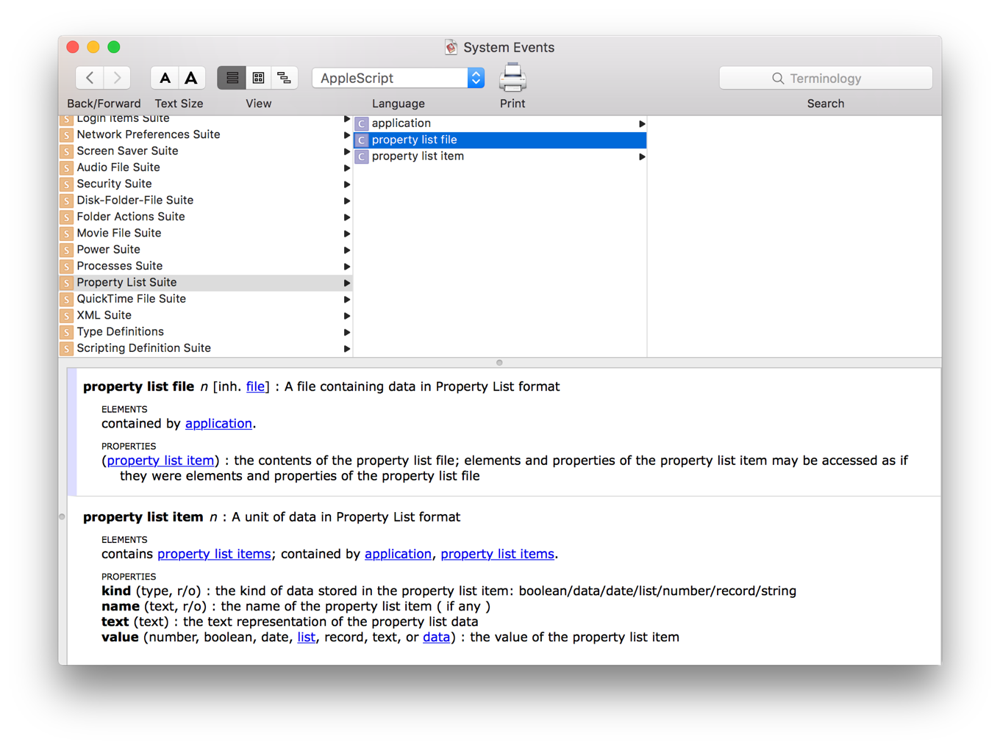

## Working with Property List Files

Many apps store settings in property list files (also called plists). Scripts can also store and retrieve data in plists. The terminology for interacting with plists is found in the Property List Suite of the System Events scripting dictionary (see Figure 35-1).

**Figure 35-1**Property list terminology in the System Events scripting dictionary

### Creating a New Property List File

Listing 35-1 demonstrates how to create a new property list file. First, an empty plist file (class `property list file`) is created. Next, individual property list items (class `property list item`) of varying type (Boolean, date, list, number, record, string) are added to the file.

**APPLESCRIPT**

[Open in Script Editor](applescript://com.apple.scripteditor?action=new&script=tell%20application%20%22System%20Events%22%0A%20%20%20%20--%20Create%20an%20empty%20property%20list%20dictionary%20item%0A%20%20%20%20set%20theParentDictionary%20to%20make%20new%20property%20list%20item%20with%20properties%20%7Bkind%3Arecord%7D%0A%0A%20%20%20%20--%20Create%20a%20new%20property%20list%20file%20using%20the%20empty%20dictionary%20list%20item%20as%20contents%0A%20%20%20%20set%20thePropertyListFilePath%20to%20%22~%2FDesktop%2FExample.plist%22%0A%0A%20%20%20%20set%20thePropertyListFile%20to%20make%20new%20property%20list%20file%20with%20properties%20%7Bcontents%3AtheParentDictionary%2C%20name%3AthePropertyListFilePath%7D%0A%0A%20%20%20%20--%20Add%20a%20Boolean%20key%0A%20%20%20%20tell%20property%20list%20items%20of%20thePropertyListFile%0A%20%20%20%20%20%20%20%20make%20new%20property%20list%20item%20at%20end%20with%20properties%20%7Bkind%3Aboolean%2C%20name%3A%22booleanKey%22%2C%20value%3Atrue%7D%0A%0A%20%20%20%20%20%20%20%20--%20Add%20a%20date%20key%0A%20%20%20%20%20%20%20%20make%20new%20property%20list%20item%20at%20end%20with%20properties%20%7Bkind%3Adate%2C%20name%3A%22dateKey%22%2C%20value%3Acurrent%20date%7D%0A%0A%20%20%20%20%20%20%20%20--%20Add%20a%20list%20key%0A%20%20%20%20%20%20%20%20make%20new%20property%20list%20item%20at%20end%20with%20properties%20%7Bkind%3Alist%2C%20name%3A%22listKey%22%7D%0A%0A%20%20%20%20%20%20%20%20--%20Add%20a%20number%20key%0A%20%20%20%20%20%20%20%20make%20new%20property%20list%20item%20at%20end%20with%20properties%20%7Bkind%3Anumber%2C%20name%3A%22numberKey%22%2C%20value%3A5%7D%0A%0A%20%20%20%20%20%20%20%20--%20Add%20a%20record%2Fdictionary%20key%0A%20%20%20%20%20%20%20%20make%20new%20property%20list%20item%20at%20end%20with%20properties%20%7Bkind%3Arecord%2C%20name%3A%22recordKey%22%7D%0A%0A%20%20%20%20%20%20%20%20--%20Add%20a%20string%20key%0A%20%20%20%20%20%20%20%20make%20new%20property%20list%20item%20at%20end%20with%20properties%20%7Bkind%3Astring%2C%20name%3A%22stringKey%22%2C%20value%3A%22string%20value%22%7D%0A%20%20%20%20end%20tell%0Aend%20tell)

**Listing 35-1**AppleScript: Creating a property list file

1. `tell application "System Events"`
2. ` -- Create an empty property list dictionary item`
3. ` set theParentDictionary to make new property list item with properties {kind:record}`
4. ` `
5. ` -- Create a new property list file using the empty dictionary list item as contents`
6. ` set thePropertyListFilePath to "~/Desktop/Example.plist"`
7. ` `
8. ` set thePropertyListFile to make new property list file with properties {contents:theParentDictionary, name:thePropertyListFilePath}`
9. ` `
10. ` -- Add a Boolean key`
11. ` tell property list items of thePropertyListFile`
12. ` make new property list item at end with properties {kind:boolean, name:"booleanKey", value:true}`
13. ` `
14. ` -- Add a date key`
15. ` make new property list item at end with properties {kind:date, name:"dateKey", value:current date}`
16. ` `
17. ` -- Add a list key`
18. ` make new property list item at end with properties {kind:list, name:"listKey"}`
19. ` `
20. ` -- Add a number key`
21. ` make new property list item at end with properties {kind:number, name:"numberKey", value:5}`
22. ` `
23. ` -- Add a record/dictionary key`
24. ` make new property list item at end with properties {kind:record, name:"recordKey"}`
25. ` `
26. ` -- Add a string key`
27. ` make new property list item at end with properties {kind:string, name:"stringKey", value:"string value"}`
28. ` end tell`
29. `end tell`

Listing 35-2 shows the contents of a property list file created by the script in Listing 35-1.

**Listing 35-2**Example XML for a property list file created by a script

1. `<?xml version="1.0" encoding="UTF-8"?>`
2. `<!DOCTYPE plist PUBLIC "-//Apple//DTD PLIST 1.0//EN" "http://www.apple.com/DTDs/PropertyList-1.0.dtd">`
3. `<plist version="1.0">`
4. `<dict>`
5. ` <key>booleanKey</key>`
6. ` <true/>`
7. ` <key>dateKey</key>`
8. ` <date>2016-01-28T19:34:13Z</date>`
9. ` <key>listKey</key>`
10. ` <array/>`
11. ` <key>numberKey</key>`
12. ` <integer>5</integer>`
13. ` <key>recordKey</key>`
14. ` <dict/>`
15. ` <key>stringKey</key>`
16. ` <string>string value</string>`
17. `</dict>`
18. `</plist>`

### Reading a Property List Key Value

Listing 35-3 shows how to read a value of a key in a property list file.

[Open in Script Editor](applescript://com.apple.scripteditor?action=new&script=tell%20application%20%22System%20Events%22%0A%20%20%20%20tell%20property%20list%20file%20thePropertyListFilePath%0A%20%20%20%20%20%20%20%20return%20value%20of%20property%20list%20item%20%22stringKey%22%0A%20%20%20%20end%20tell%0Aend%20tell%0A--%3E%20Result%3A%20%22string%20value%22)

**Listing 35-3**AppleScript: Reading a key value in a property list file

1. `tell application "System Events"`
2. ` tell property list file thePropertyListFilePath`
3. ` return value of property list item "stringKey"`
4. ` end tell`
5. `end tell`
6. `--> Result: "string value"`

### Changing a Property List Key Value

Listing 35-4 shows how to change the value of a key in a property list file.

[Open in Script Editor](applescript://com.apple.scripteditor?action=new&script=tell%20application%20%22System%20Events%22%0A%20%20%20%20tell%20property%20list%20file%20thePropertyListFilePath%0A%20%20%20%20%20%20%20%20set%20value%20of%20property%20list%20item%20%22stringKey%22%20to%20%22new%20string%20value%22%0A%20%20%20%20end%20tell%0Aend%20tell)

**Listing 35-4**AppleScript: Changing the value of a key in a property list file

1. `tell application "System Events"`
2. ` tell property list file thePropertyListFilePath`
3. ` set value of property list item "stringKey" to "new string value"`
4. ` end tell`
5. `end tell`

### Adding a New Property List Item

Listing 35-3 shows how to add a new key and value to a property list file.

[Open in Script Editor](applescript://com.apple.scripteditor?action=new&script=tell%20application%20%22System%20Events%22%0A%20%20%20%20tell%20property%20list%20items%20of%20property%20list%20file%20thePropertyListFilePath%0A%20%20%20%20%20%20%20%20make%20new%20property%20list%20item%20at%20end%20with%20properties%20%7Bkind%3Astring%2C%20name%3A%22newStringKey%22%2C%20value%3A%22new%20string%20value%22%7D%0A%20%20%20%20end%20tell%0Aend%20tell)

**Listing 35-5**AppleScript: Adding a new key and value to a property list file

1. `tell application "System Events"`
2. ` tell property list items of property list file thePropertyListFilePath`
3. ` make new property list item at end with properties {kind:string, name:"newStringKey", value:"new string value"}`
4. ` end tell`
5. `end tell`
